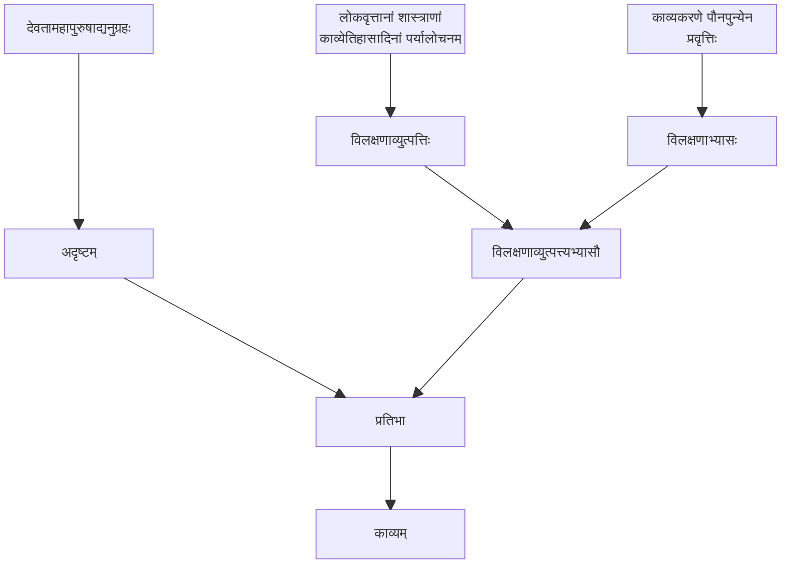

### काव्यहेतुः

तस्य च कारणं कविगता केवला प्रतिभा। सा च काव्यघटनानुकूलशब्दार्थोपस्थितिः। तद्गतं च
प्रतिभात्वं काव्यकारणतावच्छेदकतया सिद्धो जातिविशेष उपाधिरूपं वाखण्डम्। तस्याश्च हेतुः
क्वचिद् देवतामहापुरुषप्रसादादिजन्यमदृष्टम्। क्वचिच्च विलक्षणव्युत्पत्तिकाव्यकरणाभ्यासौ।

<notes>
* प्रतिभात्वम् इति जातित्वेन अथवा अखणोपाधित्वेन भवितुमर्हति (जातिः इत्यस्य व्याख्याने ऐकमत्यं नास्ति, अतः एतयोः एकतरं भवतु - द्वयमपि नित्यम् अतः क्लेशो नास्ति) ।
* एतौ (अदृष्टं विलक्षणव्युत्पत्त्यभ्यासौ च) निरपेक्षकारणौ, समुदायो नापेक्षितः । क्वचित् अदृष्टं
  स्यात्, क्वचित् विलक्षणव्युत्पत्त्यभ्यासौ, क्वचिद् द्वयमपि ।

</notes>

#### मम्मटमतखण्डनम्
न तु
त्रयमेव। बालादेस्तौ विनापि केवलान्महापुरुषप्रसादादपि प्रतिभोत्पत्तेः। न च तत्र तयोर्जन्मान्तरीययोः
कल्पनं वाच्यम्। गौरवान्मानाभावात्कार्यस्यान्यथाप्युपपत्तेश्च। लोके हि बलवता प्रमाणेनाऽऽगमादिना
सति कारणतानिर्णये पश्चादुपस्थितस्य व्यभिचारस्य वारणाय जन्मान्तरीयमन्यथानुपपत्त्या कारणं
धर्माधर्मादि कल्प्यते। अन्यथा तु व्यभिचारोपस्थित्या पूर्ववृत्तकारणतानिर्णये भ्रमत्वप्रतिपत्तिरेव
जायते।
<notes>
त्रयाणां समुदायः न कारणतां इयर्ति । बालेष्वपि क्वचित् प्रतिभोत्पत्तिदर्शनात् (न तस्य
विलक्षणव्युत्पत्तिः - शास्त्रावगाहने अनवकाशत्वात्) ।  
[पू०प०] – तर्हि तत्रादृष्टमेव मन्यताम्, विलक्षव्युत्पत्त्ययासौ जन्मान्तरीयं कारणं स्वीक्रियताम् ।  
न तद्युक्तं यतः श्रुतिप्रतिपादितकार्यकारणां प्रति तथा कल्पयितुं शक्यते । नात्रापेक्षितम् ।
</notes>

नापि केवलमदृष्टमेव कारणमित्यपि शक्यं वदितुम्। कियन्तञ्चित्कालं काव्यं कर्तुमशक्नुवतः
कथमपि संजातयोर्व्युत्पत्त्यभ्यासयोः प्रतिभायाः प्रादुर्भावस्य दर्शनात्। 
तत्राप्यदृष्टस्याङ्गीकारे प्रागपि ताभ्यां तस्याः प्रसक्तेः।
न च तत्र प्रतिभायाः प्रतिबन्धकमदृष्टान्तरं कल्प्यमिति वाच्यम्।
तादृशानेकस्थलगतादृष्टद्वयकल्पनापेक्षया क्लृप्तव्युत्पत्त्यभ्यासयोरेव प्रतिभाहेतुत्वकल्पने लाघवात्।
अतः प्रागुक्तसरणिरेव ज्यायसी।
<notes>
विलक्षव्युत्पत्त्ययासयोः निरपेक्षकारणत्वम् । पश्चित्मे वयसि अभ्यासेन प्रतिभायाः प्रादुर्भावदर्शनात् ।  
पू०प० – साधु, किन्त्वत्रापि अदृष्टं कारणत्वेन स्वीक्रियताम् ।  
न, तथा सति प्रतिभाप्रादुर्भावः पूर्वमेव अभविष्यत् (अन्यकारणनिरपेक्षत्वात्) ।  

क्लृप्त = सिद्ध
</notes>

तादृशादृष्टस्य तादृशव्युत्पत्त्यभ्यासयोश्च प्रतिभागतं वैलक्षण्यं
कार्यतावच्छेदकम्, अतो न व्यभिचारः। 
<notes>
</notes>

प्रतिभात्वं च कवितायाः कारणतावच्छेदकम्,
प्रतिभागतवैलक्षण्यमेव वा विलक्षणकाव्यं प्रतीति नात्रापि सः।

<notes>
प्रतिभाद्वयम् - अदृष्टजन्या, व्युत्पत्यभ्यासजन्या । अत्र व्यभिचारः?
सामान्यप्रतिभात्वमेव अवच्छेदकधर्मः न तु विशिष्टप्रतिभात्वम् (यथा अदृष्टजन्यप्रतिभात्वम् / व्युत्पत्त्यभ्यासजन्य...) ।
अतः व्यभिचारः नास्ति (एका एव प्रतिभा)।

युक्तिः#२ - यदि प्रतिभात्वं द्वयं, तर्हि कार्यमपि विलक्षणं स्यात् (नाम अदृष्टजन्यविशिष्टप्रतिभात्वं विलक्षकाव्यं प्रतिहेतुः,
व्युत्पत्त्यभ्यासजन्यविशिष्टप्रतिभात्वं काव्यान्तरस्य हेतुः) ।
</notes>

न च सतोरपि व्युत्पत्यभ्यासयोर्यत्र
न प्रतिभोत्पत्तिस्तत्रान्वयव्यभिचार इति वाच्यम्। तत्र तयोस्तादृशवैलक्षण्ये मानाभावेन
कारणतावच्छेदकानवच्छिन्नत्वात्।
पापविशेषस्य तत्र प्रतिबन्धकत्वकल्पनाद्वा न दोषः।
प्रतिबन्धकाभावस्य च कारणता समुदितशक्त्यादित्रयहेतुतावादिनः
शक्तिमात्रहेतुतावादिनश्चाविशिष्टा। प्रतिवादिना मन्त्रादिभिः कृते कतिपयदिवसव्यापिनि
वाक्स्तम्भे विहितानेकप्रबन्धस्यापि कवेः काव्यानुदयस्य दर्शनात्।

<notes>
पू०प० – कृतेऽप्यभ्यासे न प्रतिभादर्शनम् । अन्वयव्यभिचारः इति भाति (तत्सत्त्वे तदभावः, कारणे सत्त्वे कार्याभावः)  
व्युत्पत्तिः अभ्यासः च न विलक्षणौ भवेताम् । तस्य वैलक्षण्यं न स्यात् ।
सामान्यव्युत्पत्तिः न कारणम् । अतः न अन्वयव्यभिचारः ।  
किन्तु वैलक्षण्यं तु अनिर्वचनीयम् । तर्हि ईदृक् कारणं न युक्तम् ।

युक्तिः#२ – पापविशेषः किञ्चन प्रतिबन्धकत्वं स्यात् । सति अपि कारणे प्रतिबन्धकत्वे सति
कार्योत्पत्तिः न भवति । प्रतिबन्धकाभावः अपि अपेक्षितः किन्तु कार्यकारणभावे नोच्यते यतः
कार्यसामान्यं प्रति कारणम् (सर्वेषामपि कार्याणां तत् कारणं भवत्येव) । अन्यच्च,
समुदितशक्त्यादित्रयहेतुतावादिनः (मम्मटादयः) शक्तिमात्रहेतुताविनः (सिद्धान्ती) च द्वयोरपि
प्रतिबन्धकाभावस्य कारणता प्रतिपन्ना एव । एवं प्रतिबन्धकस्य प्रमाणमपि भवति,
क्वचित् महाकवेः (कतिपयदिवसव्यापिनिन्तं) वाक्स्तम्भित्वं दृश्यते ।
</notes>
