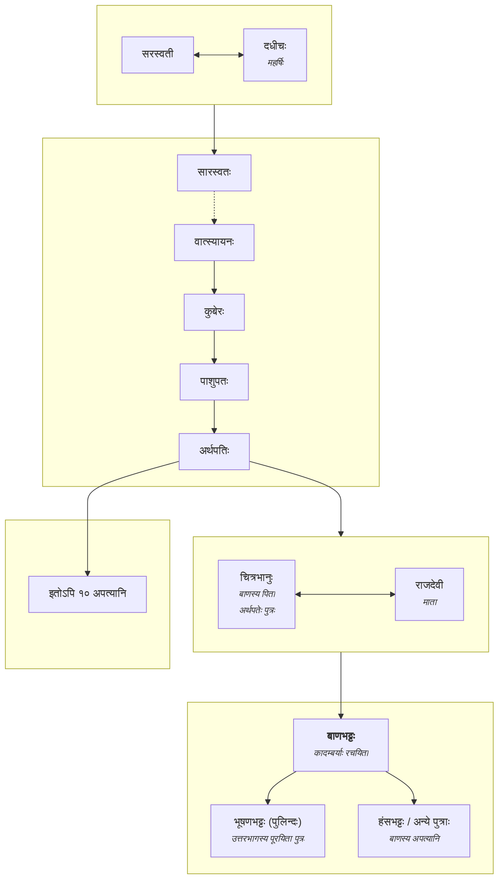
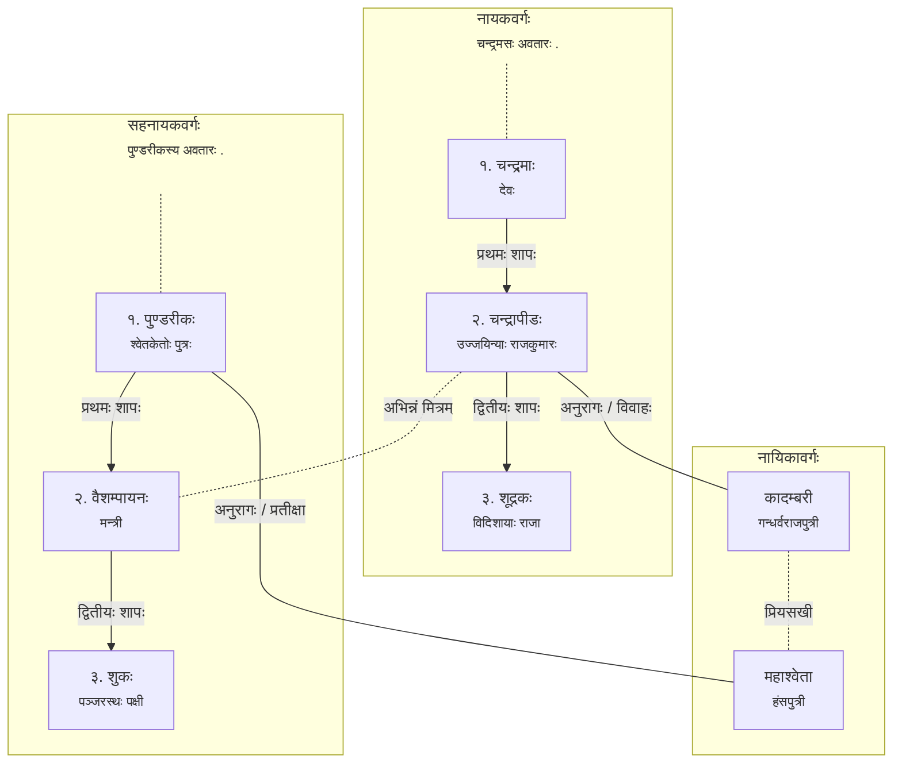

## उपयोगीनि उपकरणानि

* <http://ashtadhyayi.com> (सूत्रपाठः, धातुपाठः, गणपाठः, कोषाः)
* <http://sanskritsahitya.org> (काव्यसङ्ग्रहः, अन्वेषाणादिसौकर्यम्)

## टीकाः
* [चन्द्रकला](https://archive.org/details/KadambariKathamukha/page/n17/mode/1up) (आचार्य रेग्मी । चौखम्बा)
* [भावबोधिनी](https://archive.org/details/kadambari-edited-by-jay-shankar-lal-tripathi-krishna-das-accademy-varanasi/page/n58/mode/1up) (Krishnadas Academy)

## ग्रन्थकारपरिचयः

* कालः – ६०६-६४७
* हर्षवर्धनस्य आस्थानकविः ।
* प्रसिद्धिः –
    * बाणोच्छिष्टं जगत् सर्वम् ।
    * कादम्बरीरसज्ञानामाहारोऽपि न रोचते (श्लेषः) ।
    
> मुख्याः कवयः, साहित्यकाराः - [अत्र](../../../shastra/topics/parichaya.md/#kavayah)

### बाणभट्टस्य वंशः (वात्स्यायनः)

## पात्राणि

