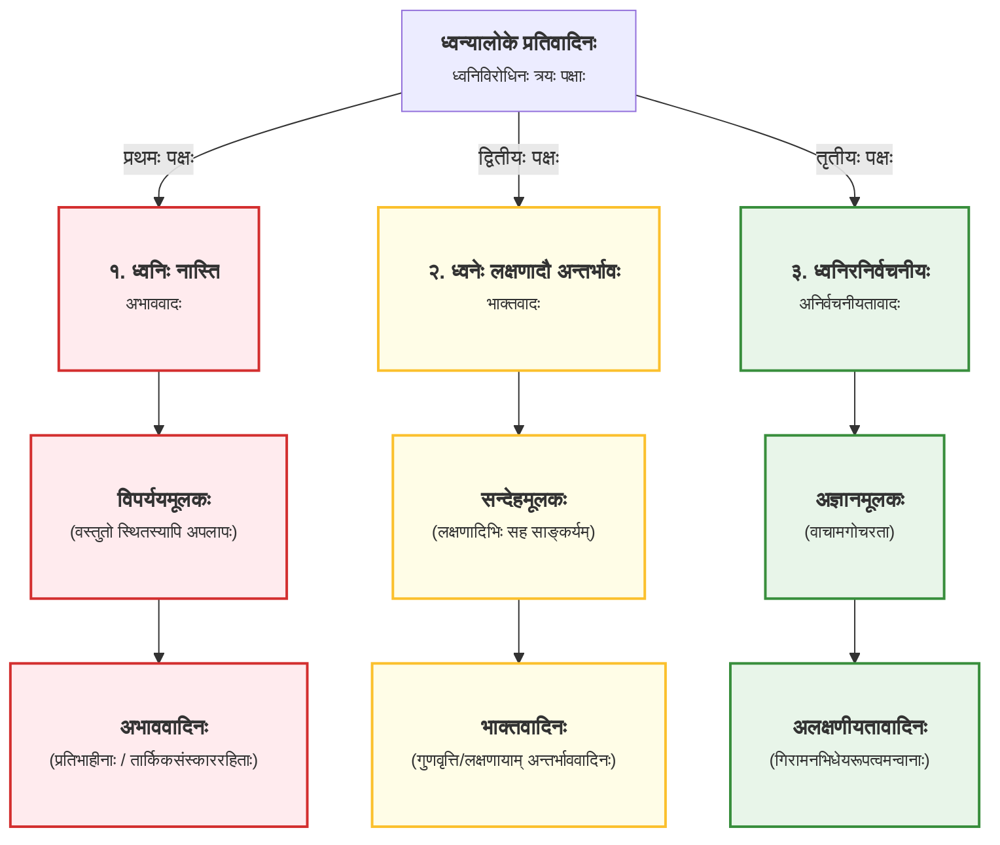

---
topics:
    - "शास्त्रपरिचयः"
    - "शब्दशक्तिः"
    - "रसः"
    - "ध्वनिः"
type: shastra-karika
karika_num: 1.0
---

## उपयोगीनि उपकरणानि

### सहायकसामग्र्यः
* <http://ashtadhyayi.com> (सूत्रपाठः, धातुपाठः, गणपाठः, कोषाः)
* <http://sanskritsahitya.org> (काव्यसङ्ग्रहः, अन्वेषाणादिसौकर्यम्)

### सन्दर्भग्रन्थाः
* [लोचनम्](https://archive.org/details/dhvanyalokalocanaofabhinavaguptaed.gangasagarraichowkambha/page/n35/mode/2up) (अभिनवगुप्ता)

## विषयपरिचयः

### ग्रन्थकारः
* आनन्दवर्धनः (~950)
* काश्मीरवासी (राजतरङ्गिणीतः ज्ञायते)
* **कृतयः** - ध्वन्यालोकः, अर्जुनचरितम्, विषमबाणलीला, देवीशतकम्, तत्त्वालोकः (वेदान्तविषयकदार्शनिकग्रन्थः)

### लोचनटीकाकर्ता

* अभिनवगुप्तः (दशमशताब्देः पूर्वार्द्धः)
* **कृतयः** - अभिनवभारती (नाट्यशाखम्), लोचनम् (ध्वन्यालोकः), तन्त्रालोकः, ईश्वरप्रत्यभिज्ञाविमर्शिनी
* <b>साहित्यशास्त्रे अवदानम्</b>
    * रसास्वादप्रक्रिया
    * सहृदयस्य व्याख्या
    * काव्यप्रयोजनम् नीत्युपदेशः (व्युत्पत्तिः)

### ध्वन्यालोकः

अयं लक्षणग्रन्थः (*लक्ष्यानुसारीणि लक्षणानि भवन्ति ।*)। ऐदम्प्रथमतया ध्वनिसिद्धान्तः प्रतिपादितः । (प्रवर्तकाचार्यः - आनन्दवर्धनाचार्यः, मम्मटः इतोऽपि पोषितवान् सिद्धान्तम्, जगन्नाथपण्डितेन खण्डितं तन्मतम्, ततः पुनः परवर्तिसाहित्यकारैः नागेशादिभिः प्रतिष्ठापितः) ।

<u>वादः</u> - कारिकावृत्तिकारयोः समानकर्तृकत्व उत भिन्नकर्तृकत्वम्? लोचनकारः मतम् - भिन्नौ कर्तारौ । परम्परा - समानौ कर्तारौ ।

#### ध्वन्यालोकस्य अवदानम्
* व्यङ्गङ्ग्रार्थयुक्तः अलङ्कारः न ध्वनिकाव्यम् ।
* रसादिध्वनिः रसवदलङ्कारः इत्यनयोः भेदः
* गुणीभूतव्यङ्ग्यकाव्यस्य लक्षणम्, काव्यस्य सौन्दर्यानुगुणं स्तरत्रये विभाजनम्
* वस्तुध्वनिः, अलङ्कारध्वनिः रसध्वनिः इत्यस्य प्रतिपादनम्
* अविवक्षितवाच्य-विवक्षितान्यपरवाच्यभेट्योः प्रतिपादनम्
* गुणानां सङ्ख्यानिर्धारणम् । (गुणाः त्रयः एव इति ऐदम्प्रथमतया उपस्थापितम्)
* गुणालङ्काराणां रसेन सह सम्बन्धः । गुण-रस (संवायः), अलङ्कार-रस (संयोग)
* सदाचारोपदेशः काव्यस्य अन्तिमम् उद्दिष्टम्  
  *सदाचारोपदेशरूपा हि नाटकादिगोष्ठी, विनेयजनहितार्थमेव मुनिभिरवतारिता । (३।३० वृ०)*

## ध्वनिविरोधिनः

ध्वनिं न सर्वे साहित्यकाराः अङ्गीकुर्वन्ति । जयरथेन १२ विरोधिनः सङ्कीर्तिताः (विमर्शिनी टीकायाम्) । ध्वनिसिद्धान्तः पृथङ् नास्ति, अन्यसिद्धान्तेषु अन्तर्भावः । यत्र अन्तर्भावः तन्मतीयाः विरोधिनः । कस्मिन्/कस्याम् अन्तर्भावः कैः कृतः?

* तात्पर्यशक्तिः । (भट्टीमीमांसकाः)
* अभिधा । (प्राभाकरमीमांसकाः)
* उपादानलक्षणा ।
* लक्षणलक्षणा । 
* स्वार्थानुमानः । (नैयायिकाः)
* परार्थानुमानः । (नैयायिकाः)
* अर्थापत्तिः ।
* श्लेषः ।
* समासोक्तिः ।
* रसः न व्यङ्ग्यः, सः कार्यः । (लोल्लटः) [रसः उत्पद्यते, कार्यः स]
* रसः न व्यङ्ग्यः, सः भोग्यः । (भट्टनायकः) [उत्पत्तिं न स्वीकुर्वन्ति, रसस्य भोज्य-भोजक-सम्बन्धः ।]
* ध्वनिः अनिर्वचनीयः । (लक्षणम् अशक्यम्)

## ध्वयालोके प्रतिवादिनः {#dhvani-prativadin}

ध्वयालोके त्रयः मुख्याः प्रतिवादिनः ।

