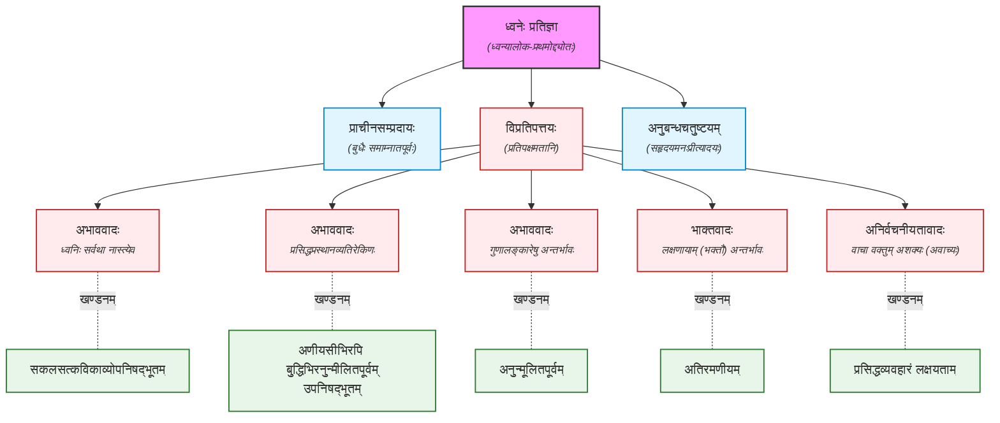

काव्यस्यात्मा ध्वनिरिति बुधैर्यः समाम्नातपूर्वस्-
तस्याभावं जगदुरपरे भाक्तमाहुस्तमन्ये ।
केचिद्वाचां स्थितमविषये तत्त्वमूचुस्तदीयं
तेन ब्रूमः सहृदयमनःप्रीतये तत्स्वरूपम् ॥ १।१ ॥

आम्नातः = आख्यातः ।
ध्वनिसिद्धान्तस्य बीजानि पूर्वाचार्याणां ग्रन्थेषु दृश्यन्ते किन्तु न स्वरूपनिरूपणं भेदनिरूपणं च ।

 
[**अभाववादिनः**]  
बुधैः काव्यतत्त्वविद्भिः, काव्यस्यात्मा ध्वनिरिति संज्ञितः, परम्परया यः समाम्नातपूर्वः सम्यक् आसमन्ताद् म्नातः प्रकटितः, तस्य सहृदयजनमनःप्रकाशमानस्याप्यभावमन्ये जगदुः। तदभावादिनां चामी विकल्पाः संभवन्ति ।

ध्वन्यालोके त्रयः मुख्याः [प्रतिवादिनः](../00.md/#dhvani-prativadin) ।

[*प्रथमः विकल्पः*]  
तत्र केचिदाचक्षीरन् – शब्दार्थशरीरन्तावत्काव्यम् । तत्र च
शब्दगताश्चारुत्वहेतवोऽनुप्रासादयः प्रसिद्धा एव । अर्थगताश्चोपमादयः । वर्णसङ्घटनाधर्माश्च ये माधुर्यादयस्तेऽपि
प्रतीयन्ते । तदनतिरिक्तवृत्तयो वृत्तयोऽपि याः कैश्चिदुपनागरिकाद्याः प्रकाशिताः, ता अपि गताः श्रवणगोचरम् ।
रीतयश्च वैदर्भीप्रभृतयः । तद्व्यतिरिक्तः कोऽयं ध्वनिर्नामेति ।

चारुत्वहेतुभूतं सर्वमपि अलङ्कारादिषु अन्तर्भवति । गुणरीतिनां अलङ्कारादिषु अन्तर्भावः । ध्वनिरपि व्यतिरिक्तः पदार्थः नास्ति ।

 
[*(पारम्पारिकाणां) द्वितीयः विकल्पः*]  
नास्त्येव ध्वनिः । प्रसिद्धप्रस्थानव्यतिरेकिणः
काव्यप्रकारस्य काव्यत्वहानेः सहृदयहृदयाहादिशब्दार्थमयत्वमेव काव्यलक्षणम् । न चोक्तप्रस्थानातिरेकिणो मार्गस्य
तत्सम्भवति । न च तत्समयान्तःपातिनः सहृदयान् कांश्चित्परिकल्प्य तत्प्रसिद्ध्या ध्वनौ काव्यव्यपदेशः प्रवर्तितोऽपि
सकलविद्वन्मनोग्राहितामवलम्बते ।

परम्परायां ध्वनितत्त्वं न कुत्रापि कीर्तितः, अतः वयं नाङ्गीकुर्मः । ध्वनौ काव्यव्यपदेशः न सम्भवति
(सकलविद्वन्मनोग्राहितां नावलम्बते) ।

 
[*तृतीयः विकल्पः*]  
न सम्भवत्येव ध्वनिर्नामापूर्वः कश्चित् । कामनीयकमनतिवर्तमानस्य तस्योक्तेष्वेव
चारुत्वहेतुष्वन्तर्भावात् । तेषामन्यतमस्यैव वा अपूर्वसमाख्यामात्रकरणे यत्किञ्चन कथनं स्यात् ।  

किञ्च वाग्विकल्पानामानन्त्यात्सम्भवत्यपि वा कस्मिंश्चित्काव्यलक्षमविधायिभिः प्रसिद्धैरप्रदर्शते प्रकारलेशे
ध्वनिर्ध्विनिरिति यदेतदलीकसहृदयत्वभावनामुकुलितलोचनैर्नृत्यते, तत्र हेतुं न विद्मः । सहस्त्रशो हि
महात्मभिरन्यैरलङ्कारप्रकाराः प्रकाशिताः प्रकाश्यन्ते च । न च तेषामेषा दशा श्रूयते ।

ध्वनिः इति चारुत्वेहेतुभूतम् इति अङ्गीकर्तुं शक्यते किन्तु न तत् किञ्चनव्यतिरिक्तं तत्त्वम् । यथा सूत्रैः अनेके शब्दाः व्युत्पादिताः भवन्ति, प्रतिशब्दं नास्ति नूतनं तत्त्वम् । तथैव अत्र मूलं तु चारुहेतुत्वम् । तच्च पूर्वजैः आचार्यैः प्रतिपादितमेव । तत्रैव ध्वनेः अन्तर्भावः क्रियताम् । ध्वनेः अपूर्वता नास्ति ।

तस्मात्प्रवादमात्रं ध्वनिः । न त्वस्य क्षोदक्षमं तत्त्वं किञ्चिदपि प्रकाशयितुं शक्यं । तथा चान्येन कृत एवात्र श्लोकः - 

*&emsp;&emsp;यस्मिन्नस्ति न वस्तु किञ्चिन मनःप्रह्लादि सालङ्कृति  
&emsp;&emsp;व्युत्पन्नै रचितं च नैव वचनैर्वक्रोक्तिशून्यं च यत् ।  
&emsp;&emsp;काव्यं तद्ध्वनिना समन्वितमिति प्रीत्या प्रशंसञ्जडो  
&emsp;&emsp;नो विद्मोऽभिदधाति किं सुमतिना पृष्टः स्वरूपं ध्वनेः ॥*

 
[**भाक्ताः**]  
भाक्तमाहुस्तमन्ये । अन्ये तं ध्वनिसंज्ञितं काव्यात्मानं गुणवृत्तिरित्याहुः ।

यद्यपि च ध्वनिशब्दसंकीर्तनेन काव्यलक्षणविधायिभिर्गुणवृत्तिरन्यो वा न कश्चित्प्रकारः प्रकाशितः,
तथापि अमुख्यवृत्त्या काव्येषु व्यावहारं दर्शयता ध्वनिमार्गौ मनाक्स्पृष्टोऽपि न लक्षित इति
परिक्ल्प्यैवमुक्तम्-'भाक्तमाहुस्तमन्ये' इति ।

<paribhasha name="भक्तिः" soure="लोचनम्">भज्यते सेव्यते पदार्थेन प्रसिद्धतयोत्प्रेक्ष्यते
इति भक्तिर्धर्मोऽभिधेयेन सामीप्यादिः ।</paribhasha> तत आगतो भाक्तो लाक्षणिकोऽर्थः ।

मुख्यार्थात् भिन्नः सर्वोऽपि अर्थः गौणार्थः । [ljk](/shastra/topics/shabdashakti/#लक्षणा)

**पू०प०** – प्राचीनैः ध्वनिः इति लक्षणायाः अर्थे प्रयुक्तः ।  
**सि०** – लाक्षणिकैः प्रयोजनरूपः व्यङ्ग्यार्थः न लक्षितः । `रूढीमूलालक्षणया अवबुध्यमानस्य
रूढीगतार्थस्य ध्वन्यर्थस्य च सम्बन्धः नास्ति` । यथा कुशलः इत्यनेन दक्षः इत्यर्थः लक्षणयैव
प्राप्यते (तथैव मण्डपः) । किन्तु `प्रयोजनवतीलक्षणयाः प्रतिपादितः अर्थः एव व्यङ्ग्यार्थः भवति`
(अत्र वक्तुः किञ्चित् प्रयोजनं बोधयितुं विवक्षा वर्तते) ।

व्यङ्ग्यार्थः, व्यञ्जकः, व्यञ्जनव्यापारः इति त्रयाणां कृते ध्वनिः इति पदं प्रयुज्यते ।
लक्षणायामेव व्यञ्जनायाः अन्तर्भावः न शक्यः । 

{#gunavritti}
**भक्तिः / लक्षणा / गुणवृत्तिः**  
पूर्वाचार्यैः भक्तिः इति पदं प्रयुक्तम् । भक्तिः लक्षणैवेति लोचनकारः (ध्व० १।१४) 
> उपचारो गुणवृत्तिः लक्षणा। उपचरणमतिशयितो व्यवहार इत्यर्थः।
> भक्तिः = गुणवृत्तिः = लक्षणा ।

'गुणद्वारेण वर्तनात् गुणवृत्तिः'  
श्रुत्या सम्बन्धविरहाद् यत् पदेन पदान्तरम् ।  
गुणवृत्तिप्रधानेन युज्यते रूपकं तु तत् ॥  
उदा० – 'अयं कलङ्किनश्चन्द्रान्मुखचन्द्रोऽतिरिच्यते' । चन्द्रगताह्लादकत्वादयो ये गुणास्तत्सदृशगुणवृत्तिः सन् मुखशब्दः चन्द्रे वर्तते ।
 
भक्तिः इति लक्षणा । लक्षणया प्रतिपादितः अर्थः भाक्तः । अत्र प्रायेण पूर्वजानां मतभेदः
अतः अत्र स्पष्टीकृतः (अन्यथा कोऽर्थः उल्लेखस्य) । लक्षणायाः प्रभेदः गौणीलक्षणाख्यः
तस्मात् गुणवृत्तिः नाम गौणीलक्षणैव इति वा स्यात् ।

**भाक्तः**  
> <paribhasha name="भाक्तः"> अभिधाव्यापारजन्यप्रतिपत्तिविषयस्य मुख्यार्थस्य पदान्तरेण साकमन्वयतात्पर्यस्य बाधे, तत्सम्बन्धे, रूढितः प्रयोजनाद्वा, अन्योऽर्थो गुणवृत्तया प्रतीतिविषयो भवति सोऽर्थः भाक्तः । </paribhasha>

 
[**अनिर्वचनीयतावादिनः**]  
केचित्पुनर्लक्षणकरणशालीनबुद्धयो ध्वनेस्तत्त्वं गिरामगोचरं सहृदयहृदयसंवेद्यमेव समाक्यातवन्तः ।
 
 
[**अनुबन्धचतुष्टयम् + खण्डनम्**]  
तेनैवंविधासु विमतिषु स्थितासु सहृदयमनःप्रीतये तत्स्वरूपं ब्रूमः ।

* विषयः – तत्स्वरूपम् । ध्वनिस्वरूपम् ।
* प्रयोजनम् – सहृदयमनःप्रीतये । ध्वनितत्त्वज्ञानद्वारा सहृदयमनःप्रीतिः ।
* अधिकारी – ध्वनिस्वरूपजिज्ञासुः ।

तस्य हि ध्वनेः स्वरूपं सकलसत्कविकाव्योपनिषद्भूतमतिरमणीयमणीयसीभिरपि
चिरन्तनकाव्यलक्षणविधायिनां बुद्धिभिरनुन्मीलितपूर्वम्, अथ च रामायणमहाभारतप्रभृतिनि
लक्ष्ये सर्वत्र प्रसिद्धव्यवहारं लक्षयतां सहृदयानामानन्दो मनसि लभतां प्रतिष्ठामिति प्रकाश्यते ॥१॥

खण्डनम् – (प्रश्नः -- कथम्?)

* सकलसत्कविकाव्योपनिषद्भूतम् = कस्मिंश्चित् प्रकारलेशे ध्वनेः अन्तर्भावस्य निराकरणम् ।
* अतिरमणीयमणीयम् = भाक्तत्त्वनिराकरणम् ।
* अनुन्मीलितपूर्वम् = गुणालङ्कारेषु अन्तर्भावस्य निराकरणम् ।
* प्रसिद्धव्यवहारं लक्षयतां = अनिर्वचनीयतावादस्य निराकरणम् ।

## सारः

## भाषा

* केचित्पुनर्लक्षणकरणशालीनबुद्धयो ध्वनेस्तत्त्वं गिरामगोचरं सहृदयहृदयसंवेद्यमेव समाक्यातवन्तः ।  
  `शालीना अप्रगल्भा बुद्धिः येषां ते!` शालीनबुद्धयः ।
* यदेतदलीकसहृदयत्वभावनामुकुलितलोचनैर्नृत्यते
