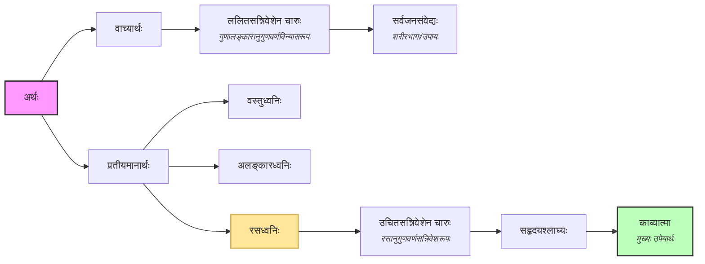

तत्र ध्वनेरेव लक्षयितुमारब्धस्य भूमिकां रचयितुमिदमुच्यते – 

योऽर्थः सहृदयश्लाघ्यः काव्यात्मेति व्यवस्थितः ।
वाच्यप्रतीयमानाख्यौ तस्य भेदावुभौ स्मृतौ ॥ १।२ ॥

काव्यस्य हि ललितोचितसन्निवेशचारुणः शरीरस्येवात्मा साररूपतया स्थितः [सहृदय](../../topics/sahrdaya.md)श्लाध्यो योऽर्थस्तस्य वाच्यः प्रतीयमानश्चेति द्वौ भेदौ ।

मुख्येयं कारिका । कारिकायां लोचने च विचारिताः विषयाः (अधः प्रदत्तं लोचनं दृश्यताम्) –

* तस्य (=काव्यात्मनः?) द्वौ भेदौ कथम्?  
  न तथा । तस्य नाम काव्यप्रतिपादितस्य अर्थस्य, तौ वाच्यप्रतीयमानौ । तत्र प्रतीयमानेष्वपि रसध्वनिः
  एव काव्यात्मा । कुतः [पञ्चविधाः](../../topics/dhvani.md) अर्थाः अथवा त्रिधा प्रभेदाः
  ध्वनेः तर्हि ।
  अन्यथा अलङ्कारभूषितं रसध्वनिविरहितं वाक्यं काव्यं न स्यात् (तद्द्वारा एव तेषां काव्यलक्षणे निवेशः) ।
  किन्तु आत्मत्वेन रसध्वनिः एव स्वीक्रियते ।  
  🤔 रसध्वनिः काव्यात्मा चेत् कथं केवलालङ्कारयुक्तं काव्यत्वेन व्यपदेष्टुं शक्यम्? आत्मरहितत्वान् न काव्यं तत्!
* `ध्वनिः गुणालङ्कारव्यतिरिक्तः न, चारुत्वहेतुत्वात्` – अस्य अभावादिनं कथनस्य द्विधा खण्डनम् ।
    * हेत्वाभासः अत्र । चारुत्वहेतुः इति हेतुः प्रतिज्ञायाम् । किन्तु पक्षे (ध्वनौ) हेतोः अविद्यमानत्वात्
      हेत्वाभासः ।  
      🤔 ध्वनिः गुणालङ्कारव्यतिरिक्तः न, चारुत्वहेतुत्वाद् इत्यत्र ध्वनिविषये उच्यते न तु ध्वनेः
      काव्यात्मत्वविषये इति भाति । अन्वयव्यतिरेकाभ्यां द्रष्टव्यम्, हेत्वाभासः कथम् इतोऽपि चिन्तनीयम्
      (आत्मनि चारुत्वं न भवति न हि अलङ्कार्यः अलङ्कारः इत्यादिकं स्पष्टम्)।
    * अनैकान्तिकः हेतुः । वाच्ये अतिव्याप्तिः । (द्वन्द्वसमासत्वात्)  

काव्यात्मत्वेन व्यवस्थितः नाम यस्यार्थस्य समावेशेन विना काव्यं काव्यपदेन व्यपदेष्टव्यं न भवति ।  
अस्यां कारिकायां विप्रतिपत्तयः ...
- आत्मा एकः, कथं भेदद्वयम्?

वाच्यार्थः तु ज्ञायते एव, किमर्थमत्र उच्यते ।
यस्मिन् विषये विप्रतिपत्तिः नास्ति स आदौ प्रतिपाद्यते, तेन लाघवम् अग्रे भवेत् । यथा
दार्शनिकाः आत्मनः ज्ञानस्वरूपं प्रतिपाद्य मतान्तरम् उपस्थापयन्ति । आत्मा ज्ञानस्वरूपम् इति
निर्विवादम्, ततः निर्विकारत्वम् इत्यादिकं प्रति साधयन्ति । तथैवात्रापि, ध्वनिविरोधिनां
ध्वनिविषये विप्रतिपत्तिः स्यात्, किन्तु वाच्यस्वरूपविषये नास्ति । तस्मात् वाच्यमेवात्र
निर्विवादभूमिः ।

अस्याः कारिकायाः आरभ्यः ध्वनेः लक्षणप्रतिपादनाय भूमिकां निरूपयति (ध्वनिलक्षण कारिका-१३) ।  

स्मृतौ इत्यस्य तात्पर्यम् यत् पूर्वाचार्यैः बीजरूपेण कीर्तितम् ध्वन्याख्यं तत्त्वम् ।

ननु ॑ध्वनिस्वरूपं ब्रूम' इति प्रतिज्ञाय वाच्यप्रतीयमानाख्यौ द्वौ भेदावर्थस्येति वाच्याभिधाने
का सङ्गतिः कारकाया इत्याशङ्क्य सङ्गतिं कर्तुमवतरणिकां करोति तत्रेति ।
एवं विधेऽभिधेये प्रयोजने च स्थित इत्यर्थः ।  

भूमिरिव भूमिका । यथा अपूर्वनिर्माणे चिकीर्षिते पूर्वं भूमिर्विरच्यते, तथा ध्वनिस्वरूपे
प्रतीयमानाख्ये निरूपयितव्ये निर्विवादसिद्धवाच्याभिधानं भूमिः । तत्पृष्टेऽधिकप्रतीयमानांशोल्लिङ्गनात् ।
वाच्येन समशीर्षिकया गणनं तस्याप्यनपह्नवनीयत्वं प्रतिपादयितुं । स्मृतावित्यनेन 'यः
समाम्नातपूर्व' इति द्रढयति ।  

* वाच्यार्थः गौणः चेत् किमर्थं तस्य समानतया गणनम् (द्वन्द्वसमासे)?  
    * तस्य अनपह्नवनीयत्वात् (अवश्यमङ्गीकार्यत्वात्) । वाच्यप्रतीयमानाख्यौ इत्यत्र वाच्यपदस्य सन्निवेशः
    निर्विवादवस्तुस्थापनम् (वाच्यविषये न कस्यापि विप्रतिपत्तिः, ज्ञाततः अज्ञातं प्रति गमनम्) ।
    वाच्यम् इति पूर्वजैः प्रतिपादितम् (यः समाम्नातपूर्वः) ।

'शब्दार्थशरीरं काव्यम्' इति यदुक्तं, तत्र शरीरग्रहमादेव केनचिदात्मना तदनुप्राणकेन भाव्यमेव । तत्र शब्दस्तावच्छरीरभाग एव सन्निविशते सर्वजनसंवेद्यधर्मत्वात्स्थूलकृशादिवत् । अर्थः पुनः सकलजनसंवेद्यो न भवति । न वाच्यसंवलनाविमोहितहृदयैस्तु तत्पृथग्भावेविप्रतिपद्यते, चार्वाकैरिवात्मपृथग्भावे । अत एव अर्थ इत्येकतयोपक्रस्य सहृदयश्लाध्य इति विशेषणद्वारा हेतुमभिधायापोद्धारद्दशा तस्य द्वौ भेदावंशावित्युक्तम्, न तु द्वावप्यात्मानौ काव्यस्येति ।  

* 'शब्दार्थशरीरं काव्यम्' इति अभाववादिनः ।
    * शरीरं चेत् शरीरी अथवा जीवतत्त्वमपि अपेक्षितम्!
    * शब्द एव शरीरम्, अर्थः इति आत्मा स्वीक्रियते चेत्
        * अर्थः तु सर्वस्यापि भवति । लौकिकः वैदिकश्च । पुनश्च वेदाः शब्दप्रधानाः ।
        * अत आह सहृदयश्लाघ्यः अर्थः । न स सर्वसंवेद्यः ।

कारिकाभागगतं काव्यशब्दं व्याकर्तुमाह – काव्यस्य हीति । ललितशब्देन गुणालङ्कारानुग्रहमाह । उचितशब्देन रसविषयमेवौचित्यं भवतीति दर्शयन्रसध्वनेर्जीवितत्वं सूचयति । तदभावे हि किमपेक्षयेदमौचित्यं नाम सर्वत्रौद्धोष्यत इति भावः ।
योऽर्थ इति यदानुवदन्परेणाप्येतत्तावदभ्युपगतमिति दर्शयति । तस्येत्यादिना तदभ्युपगम एव द्व्यंशत्वे सत्युपपद्यत इति दर्शयति । तेन यदुक्तम् – 'चारुत्वहेतुत्वाद् गुणालङ्कारव्यतिरिक्तो न ध्वनिः' इति, तत्र ध्वनेरात्मस्वरूपत्वाद्धेतुरसिद्ध इति दर्शितं । न ह्यात्मा चारुत्वहेतुर्देहस्येति भवति । अथाप्येवं स्यात्तथापि वाच्येऽनैकान्तिको हेतुः । न ह्यलङ्कार्य एवालङ्कारः, गुणी एव गुणः । एतदर्थमपि वाच्यांशोपक्षेपः । अत एव वक्ष्यति 'वाच्यः प्रसिद्धः' इति ॥२॥

सारः दृश्यताम् ।

