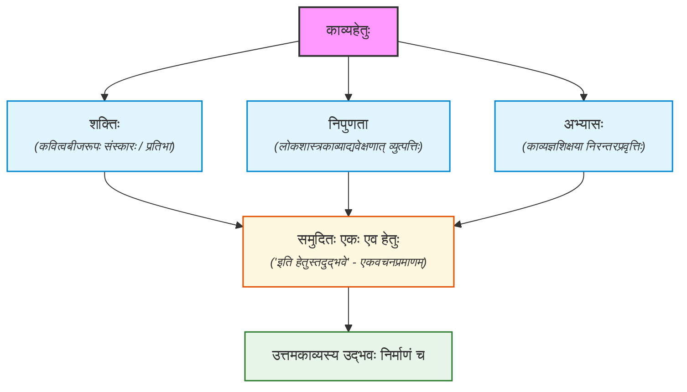

## काव्यहेतुः

शक्तिर्निपुणता लोकशास्त्रकाव्याद्यवेक्षणात्।
काव्यज्ञशिक्षयाभ्यास इति हेतुस्तदुद्भवे ॥३॥

शक्तिः कवित्वबीजरूपः संस्कारविशेषः, यां विना काव्यं न प्रसरेत्, प्रसृतं वा उपहसनीयं स्यात्। लोकस्य स्थावरजङ्गमात्मकलोकवृत्तस्य। शास्त्राणां छन्दोव्याकरणाभिधानकोशकलाचतुर्वर्गगजतुरगखड्गादिलक्षणग्रन्थानाम्। काव्यानां च महाकविसम्बन्धिनाम्। आदिग्रहणादितिहासानां च विमर्शनाद्व्युत्पत्तिः। काव्यं कर्तुं विचारयितुं च ये जानन्ति तदुपदेशेन करणे योजने च पौनःपुन्येन प्रवृत्तिरिति त्रयः समुदिताः, न तु व्यस्तास्तस्य काव्यस्योद्भवे निर्माणे समुल्लासे च हेतुर्न तु हेतवः।।
एवमस्य कारणमुक्त्वा स्वरूपमाह -

