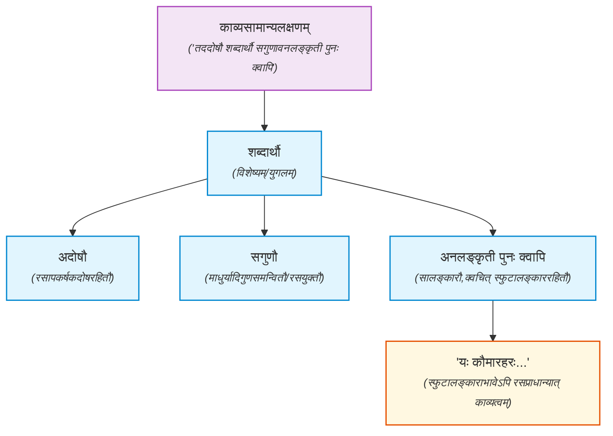

## काव्यसामान्यलक्षणम्

तददोषौ शब्दार्थौ सगुणावनलंकृती पुनः क्वापि।

गुणः रसस्य धर्मः । कथं शबदार्थौ इत्यस्य सगुणौ इति विशेषणम् ? अत्र न साक्षात् सम्बन्धः, परम्परागतसम्बन्धः ।

दोषगुणालंकाराः वक्ष्यन्ते। क्वापीत्यनेनैतदाह यत् सर्वत्र सालंकारौ, क्वचित्तु स्फुटालंकारविरहेऽपि न काव्यत्वहानिः। यथा

यः कौमारहरः स एव हि वरस्ता एव चैत्रक्षपा-  
स्ते चोन्मीलितमालतीसुरभयः प्रौढाः कदम्बानिलाः।  
सा चैवास्मि तथापि तत्र सुरतव्यापारलीलाविधौ  
रेवारोधसि वेतसीतरुतले चेतः समुत्कण्ठते ॥१॥

अत्र स्फुटो न कश्चिदलङ्कारः। रसस्य च प्राधान्यान्नालङ्कारता।

* 'अनलङ्कृती पुनः क्वापि' इति काव्यलक्षणस्य समर्थनम्  
    * अस्मिन् श्लोके कोऽपि स्फुटः (स्पष्टः) अलङ्कारः (यथा उपमा, रूपकं, उत्प्रेक्षा वा) साक्षात् न दृश्यते।
तथाप्यत्र विप्रलम्भशृङ्गारस्य (स्मरणोत्कण्ठारूपस्य रसस्य) चमत्कारोऽतीव प्रबलतया दृश्यते। अतः स्फुटालङ्काररहितत्वेऽप्यस्य
उत्तमकाव्यत्वम् अङ्गीक्रियते।
    * विप्रलम्भशृङ्गारस्य (रसस्य) प्राधान्यम् -- अनुरागातिशयात् पूर्वतनसङ्केतस्थानस्य स्मरणादुत्कण्ठा/विप्रलम्भशृङ्गारः अतिशयेन व्यज्यते।
अत्र वाच्यार्थापेक्षया व्यङ्ग्यार्थः (उत्कण्ठारूपः रसः) मुख्यः अस्ति, अतः एतत् ध्वनिकाव्यस्य (उत्तमकाव्यस्य) अपि श्रेष्ठम् उदाहरणम् अस्ति।

तद्भेदान् क्रमेणाह -
## काव्यभेदाः

### उत्तमम्

इदमुत्तममतिशयिनि व्यङ्ग्ये वाच्याद्ध्वनिर्बुधैः कथितः ॥४॥

इदमिति काव्यम्। बुधैर्वैयाकरणैः प्रधानभूतस्फोटरूपव्यङ्ग्यव्यञ्जकस्य शब्दस्य ध्वनिरिति व्यवहारः कृतः, ततस्तन्मतानुसारिभिरन्यैरपि न्यग्भावितवाच्यव्यङ्ग्यव्यञ्जनक्षमस्य शब्दार्थयुगलस्य। यथा -

* **उत्तमम्** (ध्वनिकाव्यम्) – **व्यङ्ग्यार्थः** + वाच्यार्थः ।
* **मध्यमम्** (गुणीभूतव्यङ्ग्यम्) – **वाच्यार्थः** + व्यङ्ग्यार्थः ।
* **अवरम्** (चित्रकाव्यम्) – **वाच्यार्थः** + **वाचकः** + (अस्फुटः/शून्यः) व्यङ्ग्यार्थः ।

निःशेषच्युतचन्दनं स्तनतटं निर्मृष्टरागोऽधरो  
नेत्रे दूरमनञ्जने पुलकिता तन्वी तवेयं तनुः।  
मिथ्यावादिनि दूति बान्धवजनस्याज्ञातपीडागमे  
वापीं स्नातुमितो गतासि न पुनस्तस्याधमस्यान्तिकम् ॥२॥

अत्र तदन्तिकमेव रन्तुं गतासीति प्राधान्येनाधमपदेन व्यज्यते।।
