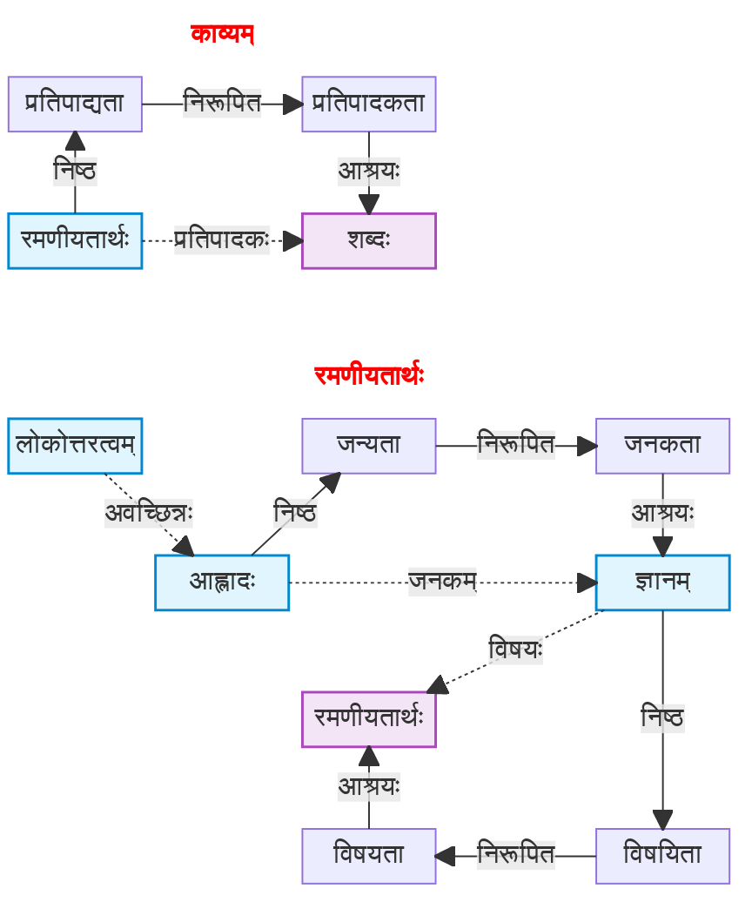
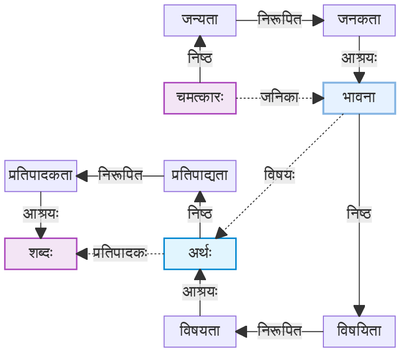
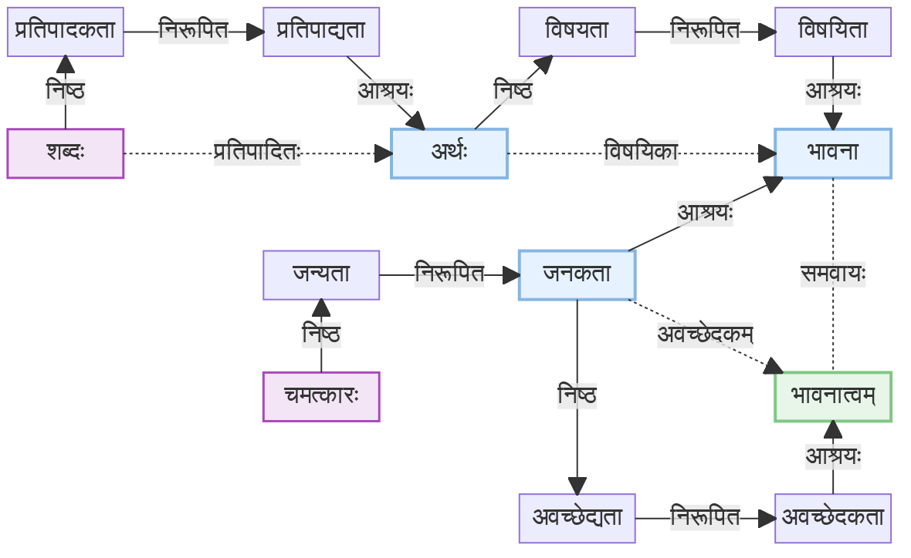

## काव्यलक्षणनिरूपणम्

तत्र कीर्तिपरमाह्लादगुरुराजदेवताप्रसादाद्यनेकप्रयोजनकस्य काव्यस्य व्युत्पत्तेः कविसहृदययोरावश्यकतया
गुणालङ्कारादिभिर्निरूपणीये तस्मिन्
विशेष्यतावच्छेदकं तदितरभेदबुद्धौ साधनं च तल्लक्षणं तावन्निरूप्यते -

रमणीयतार्थप्रतिपादकः शब्दः काव्यम्।

* रमणीयता – लौकिकवाक्येषु अतिव्याप्तिवारणाय ।
* अर्थः – व्याकरणशास्त्रे अतिव्याप्तिवारणाय । (तत्रापि वर्णविन्यासशब्दः)
* प्रतिपादकः – वाचकलक्षकव्यञ्जकेषु अतिव्याप्तिवारणाय ।
* शब्दः – कटाक्षादिचेष्टासु अतिव्याप्तिवारणाय ।

* <paribhasha name="अवच्छेदकः">अन्यूनातिवृत्तिधर्मोऽवच्छेदकः ।</paribhasha>

रमणीयता च <paribhasha name="रमणीयता">लोकोत्तराह्लादजनकज्ञानगोचरता।</paribhasha> लोकोत्तरत्वं चाह्लादगतश्चमत्कारत्वापरपर्यायोऽनुभवसाक्षिको जातिविशेषः। कारणं च तदवच्छिन्ने भावनाविशेषः पुनःपुनरनुसन्धानात्मा। 'पुत्रस्ते जातः', 'धनं ते दास्यामि' इति वाक्यार्थधीजन्यस्याह्लादस्य न लोकोत्तरत्वम्। अतो न तस्मिन् वाक्ये काव्यत्वप्रसक्तिः।

* रमणीयता = लोकोत्तराह्लादजनकज्ञानगोचरता।
    * गोचरता = विषयता ।
    * लोकोत्तरह्लादजनकं ज्ञानं, तस्य गोचरता । (अलौकिकानन्दजनकस्य ज्ञानस्य विषयता)
* लोकोत्तरत्वम् = आह्लादगतश्चमत्कारत्वापरपर्यायोऽनुभवसाक्षिको जातिविशेषः।
    * 🤔 निरूपणं कथम्? चमत्कारत्वनिष्ठप्रकारतानिरूपित-आह्लाद-निष्ठविशेष्यतानिरूपकानुभववृत्तिविषयिता,
      तन्निरूपितविषयतानिरूपितज्ञाप्यता-वत्त्वम्???
    * आह्लादगतः (आह्लादनिष्ठः)
    * चमत्कारत्वापरपर्यायः (चमत्कारत्वम् अपरपर्यायः यस्य सः) । लोकोत्तरत्वम् = चमत्कारत्वम् ।
    * अभुभवसाक्षी (सहृदयानुभवगम्यः) जातिविशेषः । *सचेतसाम् अनुभव एव प्रमाणम्* ।
    * 🤔 `कारणं च तदवच्छिन्ने भावनाविशेषः पुनःपुनरनुसन्धानात्मा।` इति लिखितमेव, तर्हि कथं 
    समूहावलम्बनज्ञाने अतिव्याप्तिः? मन्ये, लक्षणे नास्ति इति कारणात् अतिव्याप्तिः (यद्यपि व्याख्याने तु विद्यते) ।
* तादृशलोकोत्तरात्वावच्छिन्नस्य आह्लादकस्य जनकं यज्ज्ञानं, तस्य विषयता रमणीयता ।

प्रसक्तिः = आपत्तिः ।

कारणं च तदवच्छिन्ने भावनाविशेषः पुनःपुनरनुसन्धानात्मा।

* तदवच्छिन्नम् (कारणम्) = लोकोत्तरत्वावच्छिन्नं कार्यं यस्मिन् (कारणम्) ।
* अनुसन्धानम् = चर्वणारूपव्यापारः ।

भावनाविशेषः = ज्ञानधारा ।

    
चित्रं द्रष्टुं नुदतु

### प्रथमः परिष्कारः

इत्थं च चमत्कारजनकभावनाविषयार्थप्रतिपादकशब्दत्वम् (काव्यत्वम्) ।

ज्ञानपदम् अपसार्य भावनाविषयः इति निवेशितम् (समूहालन्बनज्ञाने अतिव्याप्तिवारणाय) ।

* 🤔 `शून्यं वासगृहम्` अस्य उदाहरणं टीकासु समूहालम्बनज्ञानप्रसङ्गे । कोऽर्थः, कः प्रसङ्गः?
* 🤔 समूहालम्बनज्ञानस्य उदाहरणानि । धर्मिद्वयं यत्र । अतः अनेकविशेषणयुक्तः कश्चन शब्दः?

पू०प० – एकस्मिन् क्षणे एव समूहालम्बनज्ञानं मास्तु, धारायामेव भवतु !

    
चित्रं द्रष्टुं नुदतु

### द्वितीयः परिष्कारः

यत्प्रतिपादितार्थविषयकभावनात्वं चमत्कारजनकतावच्छेदकं तत्त्वम् (तत्त्वम् = शबदत्वम् = काव्यम्) ।

* अत्र चमत्कारजनकतावच्छेदकत्वं यतः चमत्कारः नानाकारणैः जायते (यथा इन्द्रजालः)

?? नाविशेषावच्छेदकावच्छिन्न

    
चित्रं द्रष्टुं नुदतु

**दोषः**

* यत्तदित्यादिपदानां अननुगतदोषः ।
* लक्ष्यातावच्छेदकस्य गौरवम् ।
    * चमत्कारनिष्ठजन्यतानिरूपितजनकताश्रयभावनाविशेषा**वच्छेदकावच्छिन्न**विषयीभूतार्थनिष्ठप्रतिपादितानिरूपितप्रतिपादकताश्रयः शब्दत्वम् काव्यत्वम् ।

### तृतीयः परिष्कारः

स्वविशिष्टजनकतावच्छेदकार्थप्रतिपादकतासंसर्गेण चमत्कारत्ववत्त्वमेव वा काव्यत्वमिति फलितम्।

* 🤔 चमत्कारत्ववत्त्वम् = चमत्कारत्वम् । तर्हि किमर्थम् चमत्कारत्व-वत्-त्वम् ?

<!-- questions

सन्दर्भः? अधिकरणम्? पञ्चावयवाः । 

-->

## अन्यमतखण्डनम्

यत्तु प्राञ्चः `अदोषौ सगुणौ सालङ्कारौ शब्दार्थौ काव्यम्` इत्याहुः, तत्र विचार्यते - शब्दार्थयुगलं न काव्यशब्दवाच्यम्, मानाभावात्। काव्यमुच्चैः पठ्यते, काव्यादर्थोऽवगम्यते, काव्यं श्रुतमर्थो न ज्ञातः, इत्यादिविश्वजनीनव्यवहारतः प्रत्युत शब्दविशेषस्यैव काव्यपदार्थत्वप्रतिपत्तेश्च। व्यवहारः शब्दमात्रे लक्षणयोपपादनीय इति चेत्, स्यादप्येवम्, यदि काव्यपदार्थतया पराभिमते शब्दार्थयुगले काव्यशब्दशक्तेः प्रमापकं दृढतरं किमपि प्रमाणं स्याद्। तदेव तु न पश्यामः। विमतवाक्यं त्वश्रद्धेयमेव। इत्थं चासति काव्यशब्दस्य शब्दार्थयुगलशक्तिग्राहके प्रमाणे, प्रागुक्ताद् व्यवहारतः शब्दविशेषे सिद्ध्यन्तीं शक्तिं को नाम निवारयितुमीष्टे। एतेन विनिगमनाभावादुभयत्र शक्तिरिति प्रत्युक्तम्। तदेवं शब्दविशेषस्यैव काव्यपदार्थत्वे सिद्धे तस्यैव लक्षणं वक्तुं युक्तम्, न तु स्वकल्पितस्य काव्यपदार्थस्य। एषैव च वेदपुराणादिलक्षणेष्वपि गतिः। अन्यथा तत्रापीयं दुरवस्था स्याद्। यत्त्वास्वादोद्बोधकत्वमेव काव्यत्वप्रयोजकं तच्च शब्दे चार्थे चाविशिष्टमित्याहुः, तन्न। रागस्यापि रसव्यञ्जकताया ध्वनिकारादिसकलालङ्कारिकसम्मतत्वेन प्रकृते लक्षणीयत्वापत्तेः। किं बहुना नाट्याङ्गानां सर्वेषामपि प्रायशस्तथात्वेन तत्वापात्तिर्दुर्वारैव। एतेन रसोद्बोधसमर्थस्यैवात्र लक्ष्यत्वमित्यपि परास्तम्। अपि च काव्यपदप्रवृत्तिनिमित्तं शब्दार्थयोर्व्यासक्तम्, प्रत्येकपर्याप्तं वा। नाद्यः। एको न द्वाविति व्यवहारस्येव श्लोकवाक्यं न काव्यमिति व्यवहारस्यापत्तेः। न द्वितीयः। एकस्मिन् पद्ये काव्यद्वयव्यवहारापत्तेः। तस्माद् वेदशास्त्रपुराणलक्षणस्येव काव्यलक्षणस्यापि शब्दनिष्ठतैवोचिता।

लक्षणे गुणालङ्कारादिनिवेशोऽपि न युक्तः। 'उदितं मण्डलं विधोः' इति काव्ये दूत्यभिसारिकाविरहिण्यादिसमुदीरितेऽभिसरणविधिनिषेधजीवनाभावादिपरे 'गतोऽस्तमर्कः' इत्यादौ चाव्याप्त्यापत्तेः। न चेदम् अकाव्यमिति शक्यं वदितुम्। काव्यतया पराभिमतस्यापि तथा वक्तुं शक्यत्वात्। काव्यजीवितं चमत्कारित्वं चाविशिष्टमेव। गुणत्वालङ्कारत्वादेरननुगमाच्च। दुष्टं काव्यमिति व्यवहारस्य बाधकं विना लाक्षणिकत्वायोगाच्च। न च संयोगाभाववान् वृक्षः संयोगीतिवदंशभेदेन दोषरहितं दुष्टमिति व्यवहारे बाधकं नास्तीति वाच्यम्। 'मूले महीरूहो विहङ्गमसंयोगी, न शाखायाम्' इति प्रतीतेरिवेदं पद्यं पूर्वार्धे काव्यमुत्तरार्धे तु न काव्यमिति स्वरसवाहिनो विश्वजनीनानुभवस्य विरहादव्याप्यवृत्तिताया अपि तस्यायोगात्। शौर्यादिवदात्मधर्माणां गुणानाम्, हारादिवदुपस्कारकाणामलङ्काराणां च शरीरघटकत्वानुपपत्तेश्च। यत्तु 'रसवदेव काव्यम्' इति साहित्यदर्पणे निर्णीतम्, तन्न। वस्त्वलङ्कारप्रधानानां काव्यानामकाव्यत्वापत्तेः। न चेष्टापत्तिः, महाकविसंप्रदायस्याकुलीभावप्रसङ्गात्। तथा च जलप्रवाहवेगनिपतनोत्पतनभ्रमणानि कविभिर्वर्णितानि कपिबालादिविलसितानि च। न च तत्रापि यथाकथञ्चित् परम्परया रसस्पर्शोऽस्त्येवेति वाच्यम्। ईदृशरसस्पर्शस्य 'गौश्चलति', 'मृगो धावति' इत्यादावतिप्रसक्तत्वेनाप्रयोजकत्वात्। अर्थमात्रस्य विभावानुभावव्यभिचार्यन्यतमत्वादिति दिक्।
