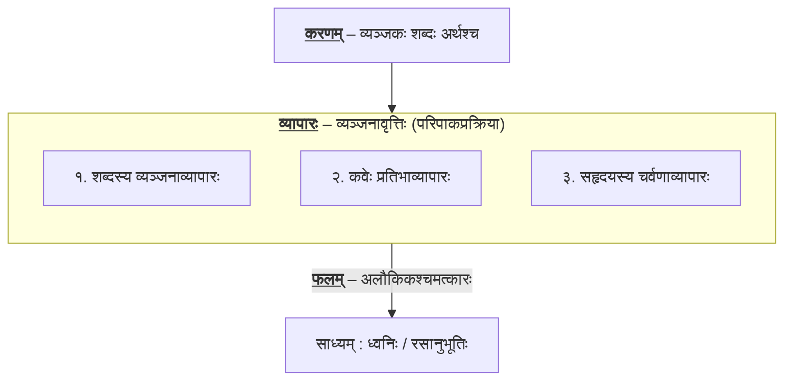

*इदमुत्तममतिशयिनि व्यङ्ग्ये वाच्याद्ध्वनिर्बुधैः कथितः ॥का०प्र० १।४॥*
वाच्यार्थं व्यङ्ग्यार्थः अतेशे यत्र तदेवोत्तमं काव्यं, ध्वनिः ।

## प्रभेदाः

* **वस्तुध्वनिः** – असामान्या प्रस्तुतिः व्यङ्ग्यरूपेण वस्तु प्रकाशयति ।  
  *हे धार्मिक, निर्भयं वने विचर यतः तवभीतिहेतुः कुक्कुरः ह्यः सिंहेन व्यापादितः!*  
  <u>वाच्यार्थस्तु</u> – त्वं पूर्वं कस्माच्चन कुक्कुरात् बिभयन् वनं न गच्छति, अधुना स कुक्कुरः मृतः । अतः स्वैरं भ्रम!  
  <u>व्यङ्ग्यार्थः</u> – वनं मा प्रविश, तत्र साम्प्रतं केसरी विराजते! (त्वं तु कुक्कुरात् बिभेति, सिंहस्य कथा तु अन्यैव!)
* **अलङ्कारध्वनिः** –  वाक्ये अलङ्कारः अवाच्यः सन्नपि व्यङ्ग्यया अलङ्कारं बोधयति ।  
  *अरिभिः सममेव समरशिरसि विगलितं रिपुस्त्रीणाम् ।*  
  <u>वाच्यार्थः</u> – युद्धे अरिभिः सहः तेषां स्त्रीणां विगलितम् (कर्तरि भावे क्तः, अतः स्त्रीणाम् इति षष्ठी) । अर्थात्, द्वयोः युगपत् नाशः ।  
  <u>व्यङ्ग्यार्थः</u> – अत्र व्यङ्ग्यया उपमालङ्कारप्रतीतिः । युद्धे रिपवः भूमौ यथा पतन्ति, तथैव तेषां भार्यादिकं मृत्युवार्तां श्रुत्वा प्राणान् त्यजन्ति । अत्र उपमा ध्वन्यते ।
* **रसध्वनिः** – विभावादिव्यापारपुरःसरं स्थायिभावः रसत्वेन परिणमते ।  
  *ग्रीवाभङ्गाभिरामं मुहुरनुपतति ष्यन्दने बद्धदृष्टिः  
   पश्चार्धेन प्रविष्टः शरपतनभिया भूयसा पूर्वकायम्।  
   शश्वदवकीर्णवर्त्मा श्रमविवृतमुखभ्रंशिभिः कीर्णवर्त्मा  
   पश्योदग्रप्लुतत्वाद्वियति बहुतरं स्तोकमुर्व्यां प्रयाति॥*
  <u>वाच्यार्थः</u> – साक्षात् दुष्यन्तस्य बाणैः आत्मानं रक्षितुकामः धावतः कृष्णसारस्य विवरणम् ।
  <u>व्यङ्ग्यार्थः</u> – अतीवरमणीयं विवरणं (विभावानुभावदिभिः) स्थायिभावम् उद्दीपयति (भयम्), ततः भयानकरसप्रतीतिः ।

## ध्वनिः vs व्यञ्जना

**पू०प०** – भाति यत् व्यञ्जनया एव ध्वनिः प्रतीयते । तर्हि को भेदः ? कुतः व्यञ्जना एव ध्वनित्वेन न स्वीक्रियते?

व्यञ्जना काचित् शब्दवृत्तिः ([शब्दशक्तिः](../../topics/shabdashakti)) । शब्दप्रयोगेण शब्दशक्त्या कश्चन अर्थः उद्बुध्यते । स अर्थः अन्यैः व्यापारैः सह विपच्यमानः चमत्कारं जनयति । तत् फलमेव ध्वनिः । व्यञ्जना तु तत्र व्यापारत्वेन तिष्ठति (शब्दप्रयोगः करणम्, शब्दस्य वृत्तिः व्यापारः) ।

प्रक्रिया एवं भवति –

* व्यञ्जकशब्दप्रयोगः (करणम्)
* व्यापारः
    * शब्दव्यापारः – वाच्यार्थे विरते सति, व्यङ्ग्यार्थस्य उद्बोधः एव अलौकिकः व्यापारः शब्दव्यापारः ।
    * कवेः प्रतिभाव्यापारः – कवेः प्रतिभया निर्मितः विन्यासविशेषः ।
    * सहृदयस्य चर्वणाव्यापारः – हृदयस्य अन्तःकरणे यः साधारणीकरणस्य तथा च अखण्डस्य रसस्य आस्वादनस्य व्यापारः भवति, सः एव चर्वणाव्यापारः । सामाजिकस्य चित्ते चर्वणाव्यापारानन्तरमेव जायते ।
* फलम् – रसानुभूत्यात्कं फलेमेव ध्वनिः ।

    

## काव्यभेदाः

| काव्यभेदः | व्यङ्ग्यार्थस्य स्थितिः | वाच्यार्थ-व्यङ्ग्यार्थयोः सम्बन्धः | पारिभाषिकी संज्ञा |
| :--- | :--- | :--- | :--- |
| **उत्तमम्** | **प्रधानः (अतिशयी)** | व्यङ्ग्यार्थः वाच्यार्थम् अतिक्रम्य मुख्यश्चमत्कारकारी भवति। | **ध्वनिकाव्यम्** |
| **मध्यमम्** | **गौणः (अप्रधानः)** | व्यङ्ग्यार्थः वाच्यार्थस्य शोभां वर्धयितुं तस्याङ्गभावं भजते। | **गुणीभूतव्यङ्ग्यम्** |
| **अधमम्** | **शून्यः (अभावः)** | व्यङ्ग्यार्थम् अभिभूय बाह्यालङ्काराणां चमत्कारः शोभते। | **चित्रकाव्यम्** |
