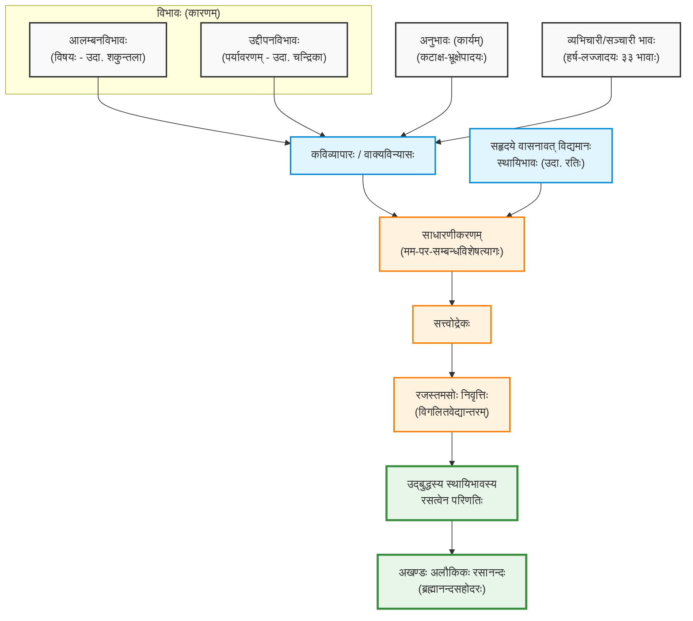
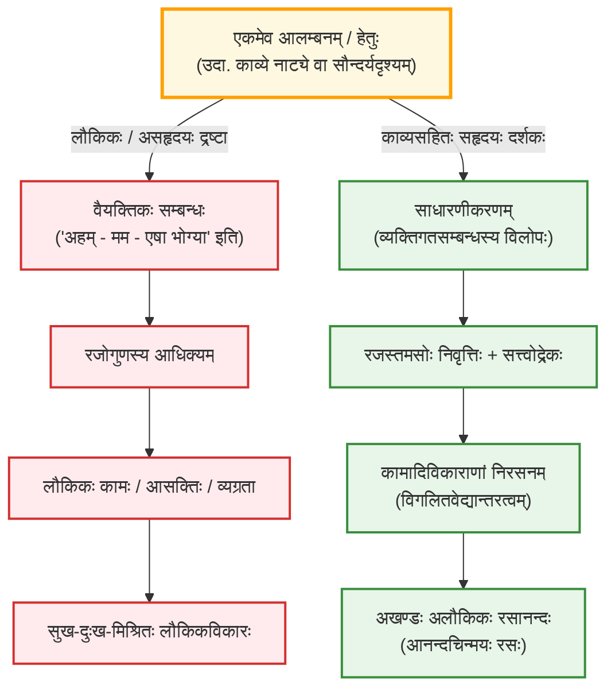

# रसः

रसो नाम कश्चन सविकल्पः अखण्डः (विगलितवेद्यान्तरः) अलौकिकानन्दः । [सहृदयानां](../sahrdaya) जायते ।

## रसावयवाः

रसस्य निष्पत्तये चत्वारः अवयवाः आवश्यकाः -

| अङ्गम् | उदाहरणम् / प्रसङ्गः |
| :---- | :---- |
| **आलम्बनविभावः** | शकुन्तला (शृङ्गारे), दुष्यन्तः (आश्रयः)। |
| **उद्दीपनविभावः** | चन्द्रोदयः, मलयजपवनः, निर्जनस्थानम्। |
| **अनुभावः** | भ्रूक्षेपः, कटाक्षः (बाह्यचेष्टाः)। |
| **सात्त्विकभावः** | स्तम्भ-स्वेद-रोमाञ्च-स्वरभङ्ग-वेपथु-वैवर्ण्य-अश्रु-प्रलयाः (अष्टौ)। |
| **व्यभिचारिभावः** | निर्वेद-ग्लानि-शङ्का-सूयाद्याः (त्रयस्त्रिंशत्/३३)। |

* **स्थायीभावः** – यः चित्ते स्थिरः भवति (यथा – रतिः, हासः)। यः भावः अन्यैः विरुद्धैः अविपरीतैः वा भावैः तिरोहितुं न शक्यते, यश्च आस्वादस्य मूलम्, सः स्थायीभावः । (रसोत्पत्तिप्रक्रियायां एकः स्थायिभावः प्रधानः अन्ये स्थायिभावाः अभिभूताः भवन्ति) । रति-हास-शोक-क्रोध-उत्साह-भय-जुगुप्सा-विस्मय-शमाः इति नव।  
  *अविरुद्धा विरुद्ध वा भाविनं रसमन्ततः।  
  पातुं पात्रीभवत्येष स स्थायी लवणाकरः॥*
* **विभावः** – (क्रिया/उद्दीपकं/कारणम्) रसस्य कारणम् (आलम्बन-उद्दीपनभेदेन द्विविधः)। लोके यानि रत्यादीनां कारणानि भवन्ति, तानि काव्ये विभावाः उच्यन्ते। एते द्विविधाः \-  
  *आलम्बनविभावः* – यं आलम्ब्य (आश्रित्य) रसः उत्पद्यते। (यथा— नायकः नायिका च)।  
  *उद्दीपनविभावः* – यः रसम् उद्दीपयति (प्रज्वलयति)। (यथा— चन्द्रिका, उपवनम्, कोकिलकूजितम्, नायकस्य गुणाः वा)।  
  *रसोद्बोधका लोके विभावाः काव्यनाटयोः॥*
* **अनुभावः** (प्रतिक्रिया) – कार्यरूपः (यथा – कटाक्षः, कटाक्षविक्षेपः)। रत्यादीनां भावानां कार्यभूताः ये बाह्यविकाराः, ते अनुभावाः। अन्तः स्थितं भावं ये बहिः प्रकटयन्ति। उदाहराणानि – भ्रूक्षेपः, कटाक्षः, मुखरागः, रोमाञ्चादयः।  
  सात्त्विकभावाः (८) – स्तम्भ-स्वेद-रोमाञ्च-स्वरभङ्ग-वेपथु-वैवर्ण्य-अश्रु-प्रलयाः इति अष्ट सात्त्विकभावाः। एते सत्त्वात् (चित्तैकाग्र्यात्) जायन्ते।  
  *उद्बुद्धं कारणैः स्वैः स्वैर्बहिर्भावं प्रकाशयन्।  
  कार्यात्मकोऽनुभावः स्याद्विकारो मानसाश्रयः॥*  
* **व्यभिचारी / सञ्चारी** भावः – ये अल्पकालं यावत् आविर्भवन्ति  । ये स्थायिनं भावं प्रति विशेषेण चरन्ति (गच्छन्ति), सञ्चरन्ति च, ते 'सञ्चारिणः'। एते स्थायिनः सहायाः इव भवन्ति। यथा समुद्रे कल्लोलाः (waves) जायन्ते लीयन्ते च, तथा एते स्थायिनि भावे निमज्ज्य तं पुष्णन्ति।  
  सङ्ख्या (३३) – निर्वेदः, ग्लानिः, शङ्का, मोहः, मदः, स्मृतिः, व्रीडा, इत्यादयः।  
  *विशेषेणाभिमुख्येन चरन्तो व्यभिचारिणः।  
  उन्मज्जननिमज्जनाभ्यां स्थायिन्यनुग्राहका हि ते॥*  

## रसनिष्पत्तिप्रक्रिया

&emsp;*विभावैरनुभावैश्च सात्त्विकैर्व्यभिचारिभिः।  
&emsp;आनीयमानः स्वाद्यत्वं स्थायी भावो रसः स्मृतः॥ (सा०द० ३।१)  
&emsp;सत्त्वोद्रेकादखण्डस्वप्रकाशानन्दचिन्मयः ।  
&emsp;वेद्यान्तरस्पर्शशून्यो ब्रह्मास्वादसहोदरः ॥  (सा०द० ३।२)  
&emsp;लोकोत्तरचमत्कारप्राणः कैश्चित्प्रमातृभिः ।  
&emsp;स्वाकारवदभिन्नत्वेनायमास्वाद्यते रसः ॥ (सा०द० ३।३)*

* **रसास्वादस्य हेतुः** – लोके यानि कारणानि, कार्याणि, सहकारीणि च भवन्ति, तानि एव काव्ये क्रमशः विभाव-अनुभाव-व्यभिचारि-संज्ञां लभन्ते।  
    * विभावः – रत्यादीनां उद्बोधकः। एषः द्विविधः – आलम्बनम् (यथा नायक-नायिके) तथा उद्दीपनम् (यथा उपवन-चन्द्रिकादि)।  
    * अनुभावः – भावस्य कार्यरूपः। यथा – कटाक्षः, भुजाक्षेपः वा।  
    * व्यभिचारी – निर्वेदादयः त्रयस्त्रिंशद् भावाः ये स्थायिनं भावं पुष्णन्ति ।  
* **निष्पत्तिप्रक्रिया** – यदा एते त्रयः मिलित्वा सामाजिकस्य (प्रेक्षकस्य) हृदयस्थं 'स्थायीभावम्' (यथा रतिम्) उद्बोधयन्ति, तदा सः भावः 'रस' संज्ञाम् अर्हति।  
    * अवस्थाभेदः – यथा दुग्धं दधिरूपेण परिणमते, तथैव स्थायीभावः विभावादिभिः परिपुष्टः सन् रसरूपेण परिणमते।  
* **साधारणीकरणम्** – एषा अस्य प्रकृतेः अत्यन्ता महत्त्वपूर्णा प्रक्रिया। रसास्वादसमये पात्रं (यथा-रामः) न केवलं व्यक्तिविशेषः भवति, अपितु तस्य साधारणीकरणं भवति, येन सामाजिकः (प्रेक्षकः) तं रसम् आस्वादयितुं शक्नोति।  
    * आशयः – रसास्वादसमये नायकः (यथा रामः) केवलं व्यक्तिविशेषः न तिष्ठति। सः 'रामः' न भूत्वा 'नायकमात्रम्' भवति।  
    * प्रभावः – प्रेक्षकः अपि स्वकीयं व्यक्तित्वं विस्मृत्य तेन पात्रेण सह एकात्मतां भजते। अत्रैव 'स्व-पर' भेदः विनश्यति।  
* **सत्त्वोद्रेकः** – विश्वनाथमते रसास्वादसमये रजस्तमोभ्यां रहितः 'सत्त्वगुणस्य' उद्रेकः भवति। अतः रसः –  
    * स्वप्रकाशः – स्वयं प्रकाशमानः।  
    * आनन्दचिन्मयः – ज्ञानयुक्तः आनन्दः।  
    * अखण्डः – यत्र विभावादीनां पृथक् प्रतीतिः न भवति। (चिन्तनीयम्, प्रतीतौ असत्यां रसान्तरगमनं कथम्?)

## रसस्य लौकिकानन्दस्य च भेदः

## नवरसाः

<table>
  <thead>
    <tr>
      <th>रसः</th>
      <th>भावः</th>
      <th>अधिदेवता</th>
      <th>टिप्पणी</th>
    </tr>
  </thead>
  <tbody>
    <tr>
      <td><b>शृङ्गारः</b></td>
      <td>रतिः</td>
      <td>विष्णुः</td>
      <td>शृङ्गं हि मन्मथोद्भेदस्तदागमनहेतुकः । उत्तमप्रकृतिप्रायो रसः शृङ्गार इष्यते ॥ (प्रमद-प्रमदालम्बनः, चन्द्रोद्यानाद्युद्दीपनः। अयं 'रसराजः' इति कथ्यते। अस्य द्वौ भेदौ – सम्भोगः विप्रलम्भश्च।)</td>
    </tr>
    <tr>
      <td><b>हास्यः</b></td>
      <td>हासः</td>
      <td>प्रमथः</td>
      <td>विकृताकृतिवाग्वेशचेष्टादेः कुहकाद्भवेत् । हास्यो हासस्थायिभावः... (विकृतवेष-वाग्-चेष्टादिभिः जायते।)</td>
    </tr>
    <tr>
      <td><b>करुणः</b></td>
      <td>शोकः</td>
      <td>यमः</td>
      <td>इष्टनाशादनिष्टाप्तेः करुणाख्यो रसो भवेत् । (इष्टनाशात् अनिष्टप्राप्त्या च उत्पद्यते।)</td>
    </tr>
    <tr>
      <td><b>रौद्रः</b></td>
      <td>क्रोधः</td>
      <td>रुद्रः</td>
      <td>कोधोऽत्र स्थायी भावः स्याद्रक्षःप्रमथदैवतः । (शत्रुकृत-अधिक्षेपादि-उद्दीपनः।)</td>
    </tr>
    <tr>
      <td><b>वीरः</b></td>
      <td>उत्साहः</td>
      <td>महेन्द्रः</td>
      <td>उत्साहशक्तिसम्पन्नः स्थेयान्वीरः स उच्यते । (दान-धर्म-दया-युद्ध-भेदेन चतुर्धा।)</td>
    </tr>
    <tr>
      <td><b>भयानकः</b></td>
      <td>भयम्</td>
      <td>कालः</td>
      <td>भयं भयानकः प्रोक्तो विकृतैर्दर्शनैस्तथा । (भीतिप्रदवस्तुदर्शनेन उद्भूतः।)</td>
    </tr>
    <tr>
      <td><b>बीभत्सः</b></td>
      <td>जुगुप्सा</td>
      <td>महाकालः</td>
      <td>जुगुप्सास्थायिभावस्तु बीभत्सः कथ्यते रसः । (मांसरुधिरपूयादिघृणास्पदवस्तुजः। घृणास्पदवस्तुदर्शनेन (यथा-रक्तमांसादि) अस्य निष्पत्तिः।)</td>
    </tr>
    <tr>
      <td><b>अद्भुतः</b></td>
      <td>विस्मयः</td>
      <td>गन्दर्वः</td>
      <td>विस्मयः स्थायी भावोऽस्य भवत्यद्भुतरूपकः । (अलौकिक-अचिन्त्य-वस्तु-दर्शन-विस्मयात्मकः।)</td>
    </tr>
    <tr>
      <td><b>शान्तः</b></td>
      <td>शमः/ निर्वेदः</td>
      <td>नारायणः</td>
      <td>शान्तः शमस्थायिभाव उत्तमप्रकृतिर्मतः । (संसारानित्यत्वज्ञानात् समुद्भूतः।)</td>
    </tr>
  </tbody>
</table>

## साहित्ये उदाहरणानि

| रसः | उदाहरणम् | प्रसङ्गः |
| :---- | :---- | :---- |
| **शृङ्गारः** | *शून्यं वासगृहं विलोक्य...* | सम्भोगशृङ्गारः (अमरुशतकात्)। |
| **करुणः** | *हा मातः\! हा तात\!* | इष्टजनविनाशात् समुत्पन्नः शोकः। |
| **वीरः** | *क्षुद्रान् हन्मि न...* | युद्धवीरस्य उत्साहः। |
| **भयानकः** | *ग्रीवाभङ्गाभिरामं मुहुरनुपतति...* | भीतस्य मृगस्य धावनम् (शाकुन्तलात्)। |
| **शान्तः** | *यदा परावरं ज्ञानम्...* | संसारवैराग्येण आत्मज्ञानसिद्धिः। |

## विकीरणम्

* व्यक्तः इत्त्यत्र प्रकाशितः इत्यर्थः न स्वीकर्तव्यः । पूर्वं विद्यमानः अदृश्यमानः घटः प्रकाशे जाते व्यक्तः भवति (दृष्टिगोचरः जायते) - अत्र तथा न स्वीकर्तव्यम् । रसः उत्पद्यते (प्रतीयते) - स्थायिभावः एव रसतां याति ।
* रसाः प्रतीयन्ते । अत्र टीकाः द्रष्टव्याः - यथा व्यवहारे ओदनं पचति इति उच्यते (किन्तु वस्तुतया पाकक्रियायाः परमेव ओदनः सम्पद्यते, पूर्वं तु तण्डुलः एव)
* भावः vs रसः - भावस्य अनुभूतिः (द्वैतम् । विभावादीनां पृथक् प्रतीतिः), रसस्य अखण्डता
* रसः वेद्यान्तरस्पर्शशून्यः, विगलितवेद्यान्तरः (विनष्टविषयान्तरः)
* अखण्डत्वे सति रसान्तरं प्रति गतिः कथम्? आलम्बनस्य परिवर्तनेन सहृदयस्य चर्वणायाः विषयः अपि परिवर्त्तते। रसस्य अखण्डता धाराप्रवाहवत्, न तु कूटस्थवत् । रसस्य 'अखण्डत्वम्' इत्यस्य अर्थः तत्क्षणे अन्यज्ञानस्य असङ्करः इति, न तु तस्याः अवस्थायाः शाश्वतत्वम्। यथा जलप्रवाहे एका तरङ्गा अखण्डा दृश्यते, तस्याः भङ्गे सत्यपि द्वितीया तरङ्गा उदेति, तद्वत् एका रसानुभूतिः समाप्य अग्रिमा अनुभूत्वा सहृदयः तरङ्गितः भवति।
* विभावादीनां (आलम्बनादीनां) तथा स्थायिभावानाम् आत्मीयता अथवा परकीयता इति सम्बन्धविशेषस्य परित्यागः साधारणीकरणम् उच्यते। यदि दर्शकः शकुन्तलां दृष्ट्वा "एषा दुष्यन्तस्य भार्या अस्ति" (परस्य इति) चिन्तयेत्, तर्हि तस्य मनसि तटास्थता (उपेक्षा) भवेत्। यदि च सः "एषा मम प्रेयसी" (मम इति) इति चिन्तयेत्, तर्हि लौकिकः कामादिः विकारः सम्भवेत्। साधारणीकरणेन तु शकुन्तला केवलं 'काचित् रमणी' इति रूपेण, दुष्यन्तश्च केवलं 'कश्चित् प्रेमी' इति रूपेण साधारणात्मना प्रकाशते। अनेन सम्बन्धविशेषमुक्तत्वात् सहृदयस्य लौकिकः संकोचः, ईर्ष्या, लज्जा, व्यक्तिगतं दुःखं च प्रणश्यति। एतदेव स्थायिभावस्य रसरूपेण परिणतेः हेतुः भवति।
* सहृदयस्य कामवृत्तिः कथं नोदेति रत्यादिविषयास्वादने? लौकिकः कामः: यदा कश्चन पुरुषः कांश्चन रमणीं पश्यति, तदा तत्र "एषा मम भोग्या" इति 'अहम्-मम' इति भावना भवति। एषः कामः रजोगुणेन आविष्टः सन् चञ्चलतां, व्यग्रतां, क्लेशं च जनयति। काव्ये साधारणीकृतः रतिभावः: काव्ये नाट्ये वा यदा आलम्बनं (यथा शकुन्तला) दृश्यते, तदा साधारणीकरणव्यापारेण तस्याः 'दुष्यन्तस्य भार्या' इति वा 'अमुकस्य स्त्री' इति वा व्यक्तिगतः सम्बन्धः विगलति। सा केवलं 'स्त्रीत्वस्य/सौन्दर्यस्य' साधारणाभिव्यक्तिः भवति। यत्र 'मम' इति व्यक्तेः अहंकारः न दृश्यते, तत्र कामातुरतायाः/लोभस्य अवकाशः एव न तिष्ठति।
