## लक्षणम्

*लक्षणप्रमाणाभ्यां वस्तुसिद्धिः ।*

### लक्षणे दोषाः

* अव्याप्तिः – लक्ष्यैकदेशावृत्तित्वम् अव्याप्तिः।  
  गोर्लक्षणं कृष्णत्वम् । (सर्वेषु गोषु लक्षणं नान्वेति)
* अतिव्याप्तिः – लक्क्ष्यातिरिक्तवृत्तित्वम् अतिव्याप्तिः।  
  गोर्लक्षणं शृङ्गित्वम् । (अन्येषां पशूनामपि शृङ्गित्वं भवति)
* असम्भवः – लक्ष्यमात्रावृत्त्यत्वम् असम्भवः।  
  गोर्लक्षणं डयनत्वम् । (न गावः डयन्ते; लक्षणं न सङ्गच्छते)

## पदार्थाः

* द्रव्याणि (९)
    * पृथिवी, आपः, तेजो, वायुः – नित्यं (परमाणुरूपम्), अनित्यं (कार्यरूपम्) ।
    * आकाशः, कालः, दिक् – एकं, नित्यं, विभुः ।
    * आत्मा – नित्यः, विभुः । जिवात्मा (अनन्ताः, प्रतिशरीरम्), परमात्मा (एकः)।
    * मनः – परमाणुरूपः (प्रतिजीवात्म) ।
* गुणाः (२४)
    * रूपं, रसः, गन्धः, शब्दः, स्पर्शः, 
    * सङ्ख्या, परिमाणं
    * पृथक्त्वं, संयोगः, विभागः
    * परत्वम्, अपरत्वम्
    * बुद्धिः, सुखं, दुःखम्, इच्छा, द्वेषः, प्रयत्नः, धर्मः, अधर्मः,
    * गुरुत्वं, द्रवत्वं, स्नेहः, संस्कारः।
* कर्माणि (५)
    * उत्क्षेपणं, अपक्षेपणं, आकुञ्चनं, प्रसारणम्, गमनम्
* सामान्यम् (२)
    *  परं (सत्ता), अपरं (द्रव्यत्वत्वादि)
* विशेषः
    * नित्यद्रव्यवृत्तिः अन्त्यो विशेषः
* समवायः
    * अयुतसिद्धवृत्तिः सम्बन्धः
* अभावः
    * प्रागभावः, प्रध्वंसाभावः, अत्यन्ताभावः, अन्योन्याभावः

## सम्बन्धाः

### पदार्थद्वयनिष्ठौ

**संयोगः** – द्रव्यद्वयस्य अनित्यसम्बन्धः । भूतले घटः ।   
**समवायः** – नित्यसम्बन्धः ।

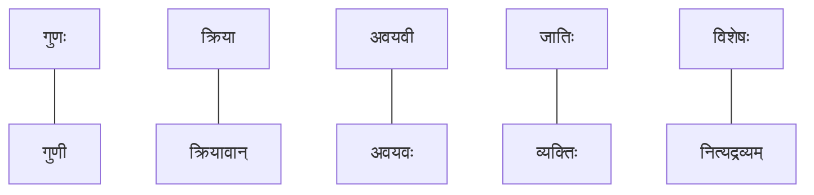
### स्वरूपसम्बन्धाः

नव्यन्यायसिद्धान्तदृष्ट्या अन्ये सर्वेऽपि सम्बन्धरूपाः वृत्तयः । यत्र संयोगसमवायौ न स्तः, तत्र अधिकरणरूपेण वा
तात्विकसम्बन्धरूपेण वा एते सम्बन्धाः स्वीकृताः सन्ति—

* **आधाराधेयभावः** – घटवत् भूतलम् ।
* **प्रतियोग्यनुयोगिभावः** – घटाभावे घटस्य प्रतियोगित्वम् ।
* **अवच्छेदकावच्छेद्यभावः** – जलत्वं जलस्यावच्छेदकम् ।
* **निरूप्यनिरूपकभावः** – प्रतिपाद्यप्रतिपादकत्वम् ।
* **विषयविषयिभावः** – घटज्ञानस्य घटेन सह सम्बन्धः।
* **कार्यकारणभावः** – दण्डघटयोः सम्बन्धः।
<!--
* **विशेषणविशेष्यभावः:** – बुद्धिस्थयोः पदार्थयोः विशेषणतया विशेष्यतया च यः सम्बन्धः अनुभूयते।
-->

## न्यायशैल्याचित्रनिरूपणम्
*(विद्याधरी इति पुस्तके पाटीलवर्यैः सविस्तरं प्रतिपादितम्)*

### आधारा-आधेय-निष्ठ-आश्रयाः

* सामान्यं वाक्यम् – भूतले घटः अस्ति ।
* नैयायिकाः – घटवत् भूतलम् ।
* निरूपणम् – *घटनिष्ठाधेयतानिरूपिताधिकरणाश्रयः भूतलम्* (घट-निष्ठ-आधेयता-निरूपित-अधिकरणता-आश्रयः भूतलम्) ।

    
चित्रं द्रष्टुं नुदतु

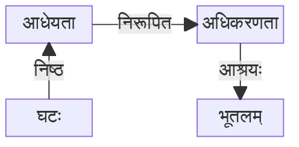

* घटस्य निरूपणमपि शक्यम् (विपरीता दिक् शराणाम्) – *भूतलनिष्ठाधिकरणनिरूपिताधेयताश्रयः घटः* ।

    
चित्रं द्रष्टुं नुदतु

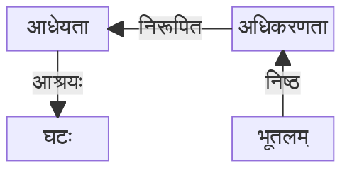

### अभावनिरूपणम्

अभावः चतुर्विधम् – प्रागभावः, ध्वंसाभावः, अत्यन्ताभावः, अन्योन्याभावः ।

* घटः नास्ति । (घटस्य अभावः । अत्र प्रतियोग्यनुयोगिभावः । घटे प्रतियोगिता, अभावे अनुयोगिताः ।)  
*अभावनिष्ठानुयोगितानिरूपितप्रतियोगिताश्रयः घटः । घटनिष्ठप्रतियोगितानिरूपितानुयोगिताश्रयः अभावः ।*

    
चित्रं द्रष्टुं नुदतु

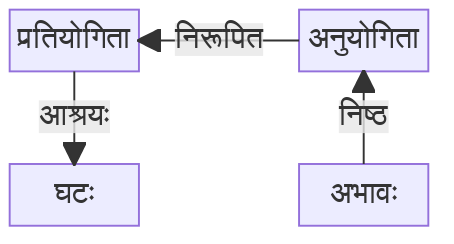

अत्र सरलतयापि वक्तुं शक्यते – *अभाव**निरूपित**प्रतियोगिताश्रयः घटः* ।

    
चित्रं द्रष्टुं नुदतु

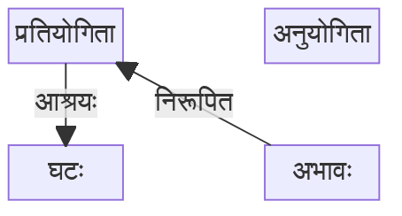

अपरस्यां दिशि सरलतया एवं वक्तुं शक्यते – *घटनिष्ठप्रतियोगिता**निरूपकः** अभावः* ।

    
चित्रं द्रष्टुं नुदतु

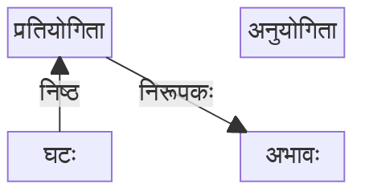

#### नित्यत्वम्

नित्यं नाम यस्य अभावः शक्यः । ध्वंसः शक्यः । तस्मात् ध्वंसनिरूपितप्रतियोगित्वं वर्तते चेत् स पदार्थः अनित्यः ।
नित्येषु ध्वंसप्रतियोगित्वं न भवति (अभावः) । अतः धवंसाप्रतियोगित्वं नित्यत्वम् (ध्वंस-अप्रतियोगित्वम्) । ध्वंसप्रतियोगित्वम् अनित्यत्वम् ।

<!--
### वायुलक्षणम्

रूपरहितस्पर्शवान् वायुः । अर्थात् वायुः – रूपाभावः , स्पर्शः इति द्वौ स्तः वायौ । रूपाभाववत्वे सति स्पर्शवत्वं 
रूपाभवायोर्लक्षणम् (रूपाभाववत्वम् इति लक्षणघटकं दलं सत्यन्तं, स्पर्शवत्वम् इति विशेष्यं दलम्) । विस्तृतम् – रूपाभावनिष्ठाधेयतानिरूपिताधिकरणताश्रयत्वे सति स्पर्षनिष्ठाधेयतानिरूपिताधिकरणताश्रयः वायुः ।
-->

## अवच्छेदकावच्छेद्यभावः

पृथक्करणमेव अवच्छेदनम् । एवं पृथक्करणसामर्थ्यं यत्र वर्तते तदेव अवच्छेदकत्वम् । यदा पदार्थद्वये एकः एव पदार्थः पदार्थः
भासते तदा तयोः पृथक्करणाय अवच्छेदकः अपेक्षितः । यथा जलाभावः, पटाभावः – द्वयोरपि निरूपणे प्रतियोगिता समाना
भासते । यथा अभावनिष्ठानुयोगितानिरूपिता प्रतियोगिता । किन्तु जलनिष्ठप्रतियोगिता भिन्ना, पटनिष्ठप्रतियोगिता भिन्ना ।
अत्र जलत्वम् इति अवच्छेदकम् । जलनिष्ठप्रतियोगिता = जलत्वनिष्ठावच्छेदकतानिरूपितावच्छेद्यताश्रयः (इयं पटनिष्ठप्रतियोगिता
भवितुं नार्हति) ।

जलत्वनिष्ठावच्छेदकतानिरूपितावच्छेद्यताश्रयजलनिष्ठप्रतियोगितानिरूपितानुयोगिताश्रयः अभावः ।  
= जलत्वनिष्ठावच्छेदकतानिरूपितावच्छेद्यताश्रयजलनिष्ठप्रतियोगिता**निरूपकः** अभावः ।  
अभावनिष्ठानुयोगितानिरूपितजलनिष्ठप्रतियोगितानिष्ठावच्छेद्यतानिरूपितावच्छेदकताश्रयः जलत्वम् ।

    
चित्रं द्रष्टुं नुदतु

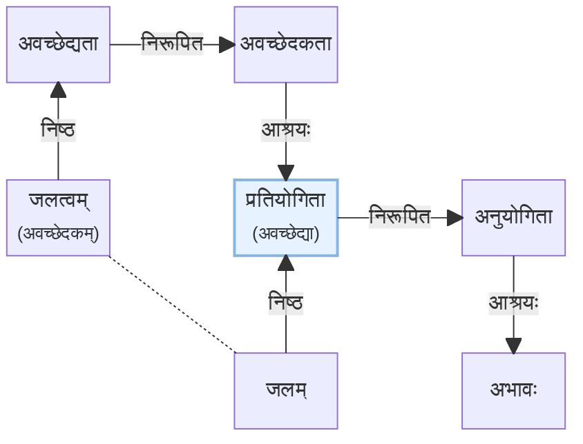

### घटत्वाच्छिन्नत्वम्

अत्र द्वे आधेयेते स्तः । तत्र कथं स्पष्टतया प्रतिपादिपादयितुं शक्यते कस्याः चर्चा क्रियते इति?

    
चित्रं द्रष्टुं नुदतु

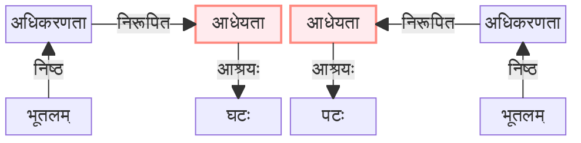

घटनिष्ठाधेयतायाः घटे विद्यमानं घटत्वम् अवच्छेदकम् । एवम् दृश्यते । अधुना स्पष्टतया पृथक् दृश्यते ।

<!--
grey: style b11 fill:#f5f5f5,stroke:#bdbdbd,stroke-width:2px
green: style m2 fill:#e8f5e9,stroke:#81c784,stroke-width:2px
red:  style t3 fill:#ffebee,stroke:#ff8a80,stroke-width:2px
blue: style m4 fill:#e6f2ff,stroke:#85b5e3,stroke-width:2px
-->

    
चित्रं द्रष्टुं नुदतु

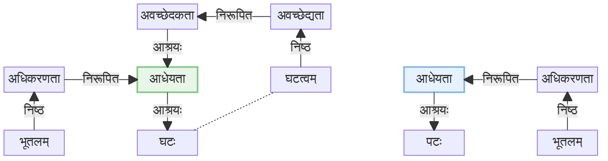

### सांसर्गिकावच्छेदकत्वम्

यदा अवच्छेदकः सम्बन्धः (संसर्गः) वर्तते तदा तन्निष्ठावच्छेदकता सांसर्गिकावच्छेदकता इत्यनेन व्यपदिश्यते ।

**ज्ञानम्** – संयोगेन भूतलं घटवत् ।

अत्राधेयतायाः अवच्छेदकत्वे द्वे स्तः – घटत्वम्, संयोगसम्बन्धः ।  
अस्य निरूपणमेवं भवति – घटत्वनिष्ठावच्छेदकतानिरूपितावच्छेद्यतावती संयोगनिष्ठ**सांसर्गिकावच्छेदकता**निरूपितावच्छेद्यतावती या घटनिष्ठाधेयता, तादृशाधेयतानिरूपिताधिकरणाश्रयः भूतलम् ।  

    
चित्रं द्रष्टुं नुदतु

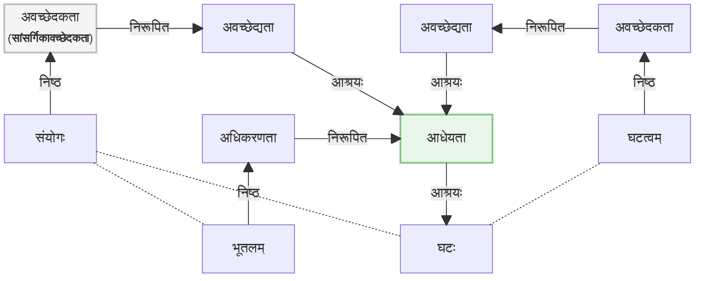

**किमर्थं सांसर्गिकावच्छेदकत्वम्?**  

पूर्वस्मिन् उदाहरणे एकस्याः एव आधेयतायाः द्वे अवच्छेदके । अग्रिमोपस्थापिते ज्ञाने द्वे भिन्ने आधेयते वर्तेते तत्र,
सांसर्गिकावच्छेदकेन भिद्येते ते द्वे ।

घटः समवायसम्बन्धेन कपाले वर्तते । अवयवावयविनोः समवायसम्बन्धः (कपालः अवयवः) । `वर्तते` इति उक्ते
सति, आधेयता भवति घटे । तथैव घटः भूतले वर्तते (संयोगसम्बन्धेन), अत्रापि आधेयता घटे आरोपिता ।
इमे आधेयते भिन्ने इति कथं प्रतिपादयितुं शक्यते? घटत्वेन तु नावच्छिद्येते यतः घटत्वनिष्ठावच्छेदकतानिरूपितावच्छेद्यताश्रयत्वं
द्वयोः आधेययोः विद्यते । पटे विद्यमाना आधेयता, घटे विद्यमानायाः घटत्वेनावच्छिद्यते, किन्तु अत्र तु घटत्वावच्छिनम्
आधेयताद्वयमपि! अत्र सांसर्गिकावच्छेदकेन भिद्येते आधेयते । एकत्र **समवाय**निष्ठसांसर्गिकावच्छेदकतानिरूपितावच्छेद्यतावती
अपरा तु **संयोग**निष्ठसांसर्गिकावच्छेदकतानिरूपितावच्छेद्यतावती ।

समवायनिष्ठावच्छेदकतानिरूपिका = संयोगावच्छिन्ना

    
चित्रं द्रष्टुं नुदतु

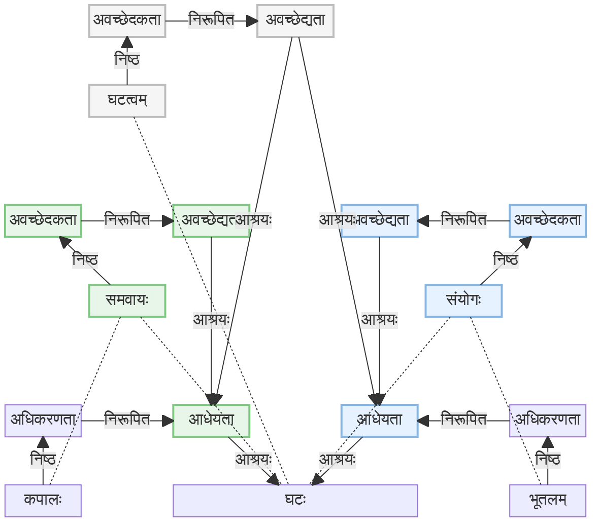

> **आकाशलक्षणम्**  
> आकाशस्य लक्षणेऽपि इयमेव प्रक्रिया । शब्दत्वनिष्ठावच्छेदकतानिरूपितावच्छेद्यतावती
> समवायनिष्ठ**सांसर्गिकावच्छेदकता**निरूपितावच्छेद्यतावती या शब्दनिष्ठाधेयता,
> तादृशाधेयतानिरूपिताधिकरणाश्रयः आकाशः । तादृशाधिकरणाताश्रयत्वम् आकाशस्य लक्षणम् ।  

### अवच्छेदकतानिरूपणम्

अवच्छेदकावच्छेद्यभावस्य निरूपणं त्रिधा भवितुम् अर्हति ।

* विकसितम् । यथा घटत्वनिष्ठावच्छेदकतानिरूपितावच्छेद्यताश्रयः घटनिष्ठाधेयता ।

    
चित्रं द्रष्टुं नुदतु

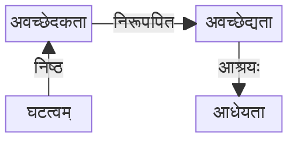

* संक्षिप्तम् । यथा घटत्वनिष्ठावच्छेदकतानिरूपिता घटनिष्ठाधेयता ।

    
चित्रं द्रष्टुं नुदतु

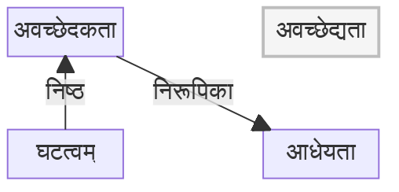

* मुकुलितम् । यथा घटत्वावच्छिन्ना घटनिष्ठाधेयता । (घटत्वेन अवच्छिन्ना)

    
चित्रं द्रष्टुं नुदतु

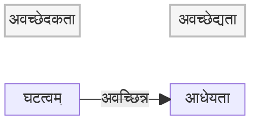

> घटत्वनिष्ठावच्छेदकतानिरूपितावच्छेद्यताश्रयः घटनिष्ठाधेयता ।  
> = घटत्वनिष्ठावच्छेदकता**निरूपिता** घटनिष्ठाधेयता ।  
> = घट**त्वावच्छिन्ना** घटनिष्ठाधेयता । (घटत्वेन अवच्छिन्ना)

## विषयविषयिभावः

ज्ञानम् आत्मनः गुणः । बुद्धौ ज्ञानं कथं सम्पद्यते इत्यत्र किञ्चित् कल्पितम् ।

ज्ञानम् – <u>भूतले घटः भासते/अवगाहते</u> इति ज्ञानस्य विषयत्रयम् – घटः, भूतलम्, संयोगसम्बन्धः । विषयेषु विषयता अस्ति, ज्ञाने विषयिता अस्ति । अतः अत्र विषयविषयिभावः । घटस्य ज्ञानस्य सम्बन्धः एवं निरूप्यते घटनिष्ठविषयतानिरूपितविषयिताश्रयः ज्ञानम् । किन्तु विषयत्रयम्, तेषां व्यपदेशत्रयं एवं कृतम् । प्रकारताख्या विषयता (घटे), संसर्गताख्या विषयता (संयोगे), विशेष्यताख्या विषयता (भूतले) ।

ज्ञानस्य आकारः – भूतलं संयोगेन घटवत् ।

> अत्रावहगाहते / भासते इत्यस्य प्रयोगः । अस्ति इत्युक्ते सति आधाराधाधेयभावः मनसि स्फुरति ।
> विषयविषयिभावे निरूपणकाले भासते, अवगाहते इत्यनयोः प्रयोगः ।

घटत्वावच्छिनघटनिष्ठप्रकारताख्यविषयतानिरूपकं ज्ञानम् । तथैव विषयता ज्ञाननिरूप्या भवति ।

    
चित्रं द्रष्टुं नुदतु

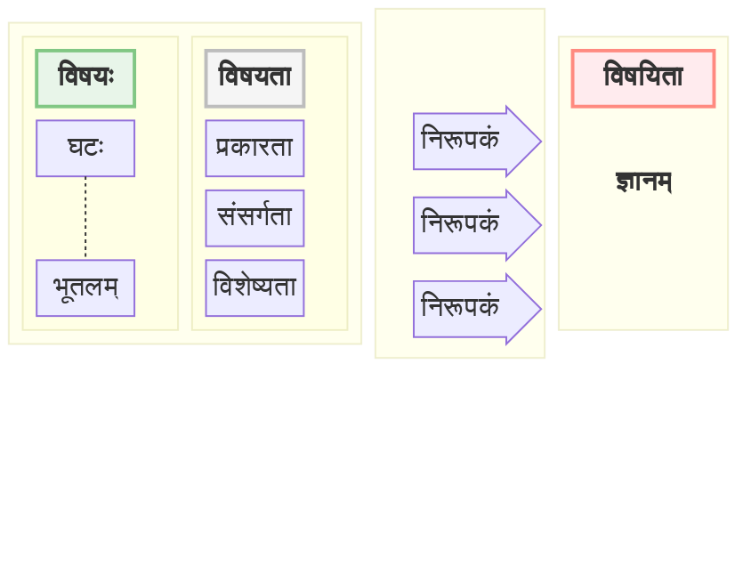

तथैव अन्येषां ज्ञानानां विषये । यथा ज्ञानम् – घटे रूपं भासते । अस्य ज्ञानस्य आकारः – घटः समवायेन रूपवान् (संक्षेपः – रूपी घटः) ।

अन्यत् उदाहरणम् । ज्ञानम् – भूतले रथः, रथे श्रीरामः । अस्य ज्ञानस्य आकारः –  भूतलं श्रीरामवत् रथवत् ।
श्रीरामे प्रकारता, रथः विशेष्यता प्रकारता च, भूतलम् विशेष्यता । श्रीरामे मुख्यप्रकारता (यतः तत्र विशेष्यता नास्ति),
भूतले मुख्यविशेष्यता (प्रकारता नास्ति), रथे अन्तराभासमानविषयता ।  
प्रकारता विशेष्यता सापेक्षे भवतः । अर्थात् – रथनिष्ठविशेष्यतानिरूपितप्रकारताश्रयः श्रीरामः , श्रीरामनिष्ठप्रकारतानिरूपितविशेष्यताश्रयः रथः ।

सम्पूर्णं ज्ञाननिरूपणम् –  श्रीरामत्वावच्छिन्नश्रीरामनिष्ठप्रकारता-निरूपितविष्यताश्रय-रथनिष्ठरथत्वावच्छिन्नप्रकारता-निरूपितभूतलत्वावच्छिन्न-भूतलनिष्ठविशेष्यतानिरूपकं ज्ञानम् ।

> एवं ज्ञानं विषयेषु विषयविषयिभावेन वर्तते । आत्मनि तु समवायसम्बन्धेन । तस्मात् ज्ञानवान् आत्मा इति
> आत्मलक्षणं नोक्तम् । घटपटादिषु अतिव्याप्तिः (ज्ञानं तत्रापि वर्तते [भिन्नसम्बन्धेन]!)। अतः ज्ञानाधिकरणः
> आत्मा ।

विषयता त्रिधा उक्ता । तथैव विषयिताः अपि – प्रकारिताख्या, संसर्गिताख्या, विशेष्यिताख्या ।

## कार्यकारणभावः

कार्यकारणभावः = जन्यजनकभावः ।

उदाहरणम् – अतीतादिव्यवहारहेतुः कालः । ज्ञानजनकशब्दप्रयोगः व्यवहारः । घटः आसीद् इत्यादिशब्दप्रयोगेण शाब्दप्रमाख्यां ज्ञानं जायते । अस्य ज्ञानस्य आकारे अतीतत्वं प्रकारविधया भासते, घटः विशेष्यविधया भासते ।  
एवं शब्दप्रयोगः सविषयं ज्ञानं प्रति कारणम् । ज्ञानस्य विषयः घटः, तस्य अतीतत्वं च । इदं ज्ञानम् अतीतत्वनिष्ठप्रकारकनिरूपकं ज्ञानम् ।

सम्पूर्णतया एवम् उच्यते – घटनिष्ठविशेष्यतानिरूपकम् अतीतत्वनिष्ठप्रकारतानिरूपकं यत् ज्ञानं तादृशज्ञाननिष्ठकार्यतानिरूपित-कारणताश्रयशब्दप्रयोगनिष्ठकार्यतानिरूपित-कारणताश्रयः कालः ।

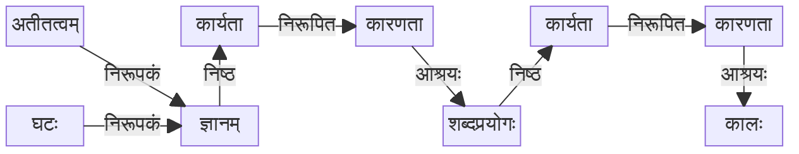

## अनुमानम्

* अनुमितिकरणम् **अनुमानम्** ।  
  *करणम् असाधारणं कारणम् । साधारणानि तु कालदिगित्यादयः भवन्त्येव ।*
* परामर्शजन्यं ज्ञानम् **अनुमितिः** ।  
  *अनुमानम् = परामर्शः ।  
  परामर्शजन्यत्वे सति ज्ञानम् इति अनुमितिलक्षणम् । दलद्वयम् अत्र अन्येषु ज्ञानेषु अतिव्याप्तिवारणाय
  (इन्द्रियसन्निकर्षजन्यम् अपि ज्ञानम्) । परामर्शजन्यत्वम् इत्येव उक्ते सति परामर्शध्वंसे अतिव्याप्तिः
  (ज्ञानादयः क्षणिकाः एव, परेण जातेन ज्ञानेन नश्यति । अवधेयम् - ध्वंसं प्रति प्रतियोगी अपेक्षितः
  अन्यथा ध्वंसः न शक्यः, तेन परामर्शः परामर्शध्वंसं प्रति कारणीभूतः) ।*
* साध्याभावाधिकरणनिरूपितवृत्तित्वाभावः **व्याप्तिः** ।
* व्याप्तिविशिष्टपक्षधर्मताज्ञानं **परामर्शः** ।  
  *व्याप्तिविशिष्टज्ञानं = व्याप्तिः विषयः यस्मिन् ज्ञाने।
* व्याप्यस्य पर्वतादिवृत्तित्वं **पक्षधर्मता** ।

> परम्परायाम् उपयुज्यमानाः पर्यायाः
>
> * साध्यम् = लिङ्गी = विधेयः
> * पक्षः = उद्देश्यः
> * हेतुः = कारणम् = लिङ्गम्

<u>त्रिविधं ज्ञानम्</u>

* केवलं विशिष्टं ज्ञानम् । एकः धर्मी, एकः प्रकारः । घटत्वम् – घटः ।
* समूहालम्बनं ज्ञानम् = नानाविशेष्यतानिरूपकं ज्ञानम् । धर्मिणौ द्वौ, प्रकारद्वयम् । यथा पुष्पवन्तं पदं सूर्यं चन्द्रं च बोधयति ।
* एकत्र द्वयम् । एकः धर्मी, प्रकारद्वयम् । यथा स्वर्गः इति शब्दः सुखत्वविशिष्टं दुःखासम्भिन्नत्वविशिष्टं सुखं बोधयति  ।

### व्याप्तिः

साध्याभावाधिकरणनिरूपितवृत्तित्वाभावः **व्याप्तिः** । `यत्र यत्र धूमः तत्र तत्र वह्निः इति साहचर्यनियमः व्याप्तिः` ।
साहचर्यनियमो नाम सर्वदा सामानाधिकरण्यम् (धूमस्य । वह्निव्यतिरिके पदार्थे न भवति) ।

साध्याभावाधिकरणनिरूपितवृत्तित्वाभावः इत्यस्य आकारः एवम् वर्तते – (वह्नि-धूमौ अधिकृत्य) धूमः व्याप्तिमान् = वह्न्यभावाधिकरणनिरूपितवृत्तित्वाभाववान् ।  
निरूपणम् – साध्यनिष्ठप्रकारतानिरूपित... वृत्तित्वावच्छिनप्रकारता या अभावनिष्ठविशेष्यता तादृशविशेष्यतानिरूपकं ज्ञानं व्याप्तिः ।  
सचित्रं एवम् अस्ति –  

    
चित्रं द्रष्टुं नुदतु

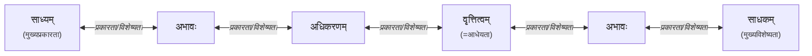

संयोगः, समवायः, इत्यादयः सम्बन्धाः । व्याप्तिः इति साध्यस्य साधकस्य कञ्चन विलक्षणं सम्बन्धं बोधयति । एतं ज्ञात्वा तस्य सम्बन्धवतः (धूमस्य) ज्ञानेन तज्ज्ञाननिरूपकस्य (वह्नेः) अनुमितिः उत्पद्यते ।

पक्षधर्मतायाः आकारः – धूमः (व्याप्यः) प्रकारत्वेन भासते, पर्वतः विशेष्यत्वेन भासते ।

<u>परामर्शस्य आकारः</u> – पर्वतः वह्व्यभावाधिकरणनिरूपितवृत्तित्वाभाववत् धूमवान् । (संक्षिप्तं, व्याप्तिमवलम्ब्य, पर्वतः वह्निव्याप्तिमद् धूमवान् । अथवा पर्वतः वह्निव्याप्यः धूमवान् ।)

### पञ्चावयवाः

न्यायशास्त्रानुसारम् अनुमानस्य पञ्चावयवाः –

* प्रतिज्ञा – साध्यनिर्देशः प्रतिज्ञा। (पक्षे साध्यस्य आरोपः वा प्रतिपादनम्)  
  *पर्वतो वह्निमान् ।* 
* हेतुः – हेतुप्रतिपादनं लिङ्गबोधकवाक्यम्। (साध्यसाधकस्य हेतोः प्रतिपादनम्)।  
  *धूमात् (धूमवत्त्वात्) ।* 
* उदाहरणम् – व्याप्तिप्रतिपादकं दृष्टान्तसहितं वाक्यम्।  
  *यो यो धूमवान् स स वह्निमान्, यथा महानसम् ।*
* उपनयः – पक्षे हेतोः व्याप्त्या विशिष्टस्य पक्षधर्मतायाः प्रतिपादको वाक्यविशेषः। (उभयविधव्याप्तेः पक्षे उपसंहारः)।  
  *तथा चायं धूमवान् (अयमपि पर्वतो धूमवान्)।*
* निगमनम् – पञ्चावयवानां संहारेण साध्यस्य उपसंहाररूपं वाक्यम्।  
  *तस्मात् तथा (तस्मात् वह्निमान् पर्वतः)।*

## हेत्वाभासः

*... लेखनीयम् ...*
